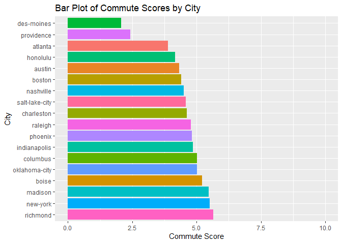
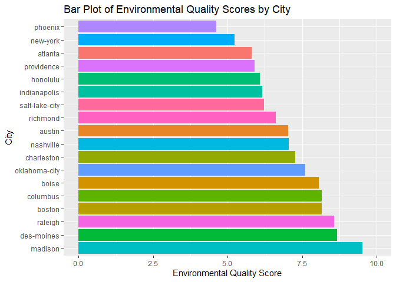
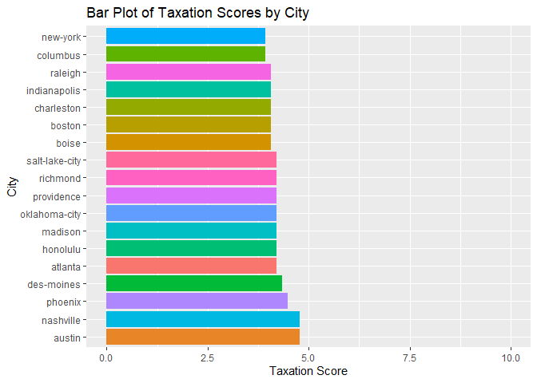
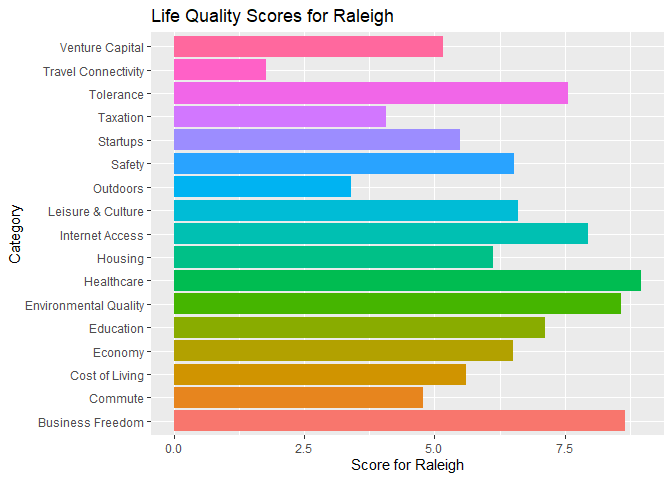

ST558 Project 2
================
Hui Fang
2023-10-04

# Vignette of Teleport API

## Introduction

The document serves as a vignette describing how to read and summarize
data from an [API](https://en.wikipedia.org/wiki/API). In this
demonstration, I have used the Teleport API. The [Teleport
API](https://developers.teleport.org/api/) is an integrated data system
that offers an up-to-date quality of life database for Planet Earth,
incorporating data from over 300 different dimensions from more than 70
different sources.

## Packages requirements

The following `R` packages were used to create the vignette. Users are
encouraged to have these packages installed or loaded to run the
functions below.  
- [httr :](https://httr.r-lib.org/) For assessing the API  
- [jsonlite
:](https://cran.r-project.org/web/packages/jsonlite/index.html) For
interacting with API  
- [tidyverse :](https://www.tidyverse.org/) A set of packages for data
manipulation and visualization  
- [knitr :](https://cran.r-project.org/web/packages/knitr/index.html)
For friendly displaying tables in a markdown  
-
[kableExtra:](https://cran.r-project.org/web/packages/kableExtra/index.html)
For building complex HTML or ‘LaTeX’ tables  
- [stringr](https://cran.r-project.org/web/packages/stringr/index.html)
For working with character strings in R programming  
- [countrycode](https://cran.r-project.org/web/packages/countrycode/)
For converting country names and country codes

Install and load the packages

``` r
library(httr)
library(jsonlite)
library(tidyverse)
```

    ## ── Attaching core tidyverse packages ──────────────────────── tidyverse 2.0.0 ──
    ## ✔ dplyr     1.1.3     ✔ readr     2.1.4
    ## ✔ forcats   1.0.0     ✔ stringr   1.5.0
    ## ✔ ggplot2   3.4.3     ✔ tibble    3.2.1
    ## ✔ lubridate 1.9.2     ✔ tidyr     1.3.0
    ## ✔ purrr     1.0.2     
    ## ── Conflicts ────────────────────────────────────────── tidyverse_conflicts() ──
    ## ✖ dplyr::filter()  masks stats::filter()
    ## ✖ purrr::flatten() masks jsonlite::flatten()
    ## ✖ dplyr::lag()     masks stats::lag()
    ## ℹ Use the conflicted package (<http://conflicted.r-lib.org/>) to force all conflicts to become errors

``` r
library(knitr)
library(stringr)
library(kableExtra)
```

    ## 
    ## Attaching package: 'kableExtra'
    ## 
    ## The following object is masked from 'package:dplyr':
    ## 
    ##     group_rows

``` r
library(countrycode)
```

## Gaining Access to the API

Teleport API does not require a key for access, making it less complex
to use compared to other APIs that require a key. Users can simply vist
the [Teleport API](https://developers.teleport.org/api/) website and
follow the instructions to query the endpoints they want.

## Develop functions to query the API

### Query median salary of different jobs from 50 countries

``` r
# Define a list of ISO alpha-2 country codes for the 50 countries to retrieve salary data for
country_codes <- c(
  "US", "GB", "DE", "FR", "CA",  # Existing countries
  "AU", "BR", "CN", "IN", "ID",  # Add more countries as needed...
  "JP", "KR", "MX", "RU", "SA",
  "ZA", "AR", "TR", "IT", "ES",
  "EG", "NG", "PK", "BD", "VN",
  "MY", "PH", "TH", "NL", "BE",
  "SE", "NO", "DK", "FI", "IE",
  "SG", "CH", "AT", "PL", "CZ",
  "HU", "GR", "PT", "IL", "AE",
  "QA", "KW", "OM", "BH", "LB"
)

# Initialize an empty list to store salary data for each country
country_salary_data_list <- list()

# Loop through the country codes and fetch salary data for each country
for (country_code in country_codes) {
  # Define the URL for the salary data API endpoint for the current country
  url <- paste0("https://api.teleport.org/api/countries/iso_alpha2%3A", country_code, "/salaries/?embed=", country_code)
  
  # Make an HTTP GET request to retrieve salary data
  response <- GET(url)
  
  # Check if the request was successful (HTTP status code 200)
  if (httr::status_code(response) == 200) {
    # Parse the JSON response into a list or data frame
    country_salary_data <- fromJSON(content(response, "text"))
    
    # Store the salary data in the list
    country_salary_data_list[[country_code]] <- country_salary_data
  } else {
    cat("Error: Unable to fetch salary data for", country_code, "\n")
  }
}
```

### Query median salary of first tier cities worldwide

``` r
# Define a list of city slugs for 52 first-tier cities
first_tier_city_slugs <- c(
  "new-york", "los-angeles", "chicago", "miami", "san-francisco-bay-area",
  "london", "paris", "berlin", "madrid", "rome",
  "beijing", "shanghai", "hong-kong",
  "tokyo", "osaka", "seoul", "sydney", "melbourne",
  "mexico-city", "sao-paulo", "rio-de-janeiro", "buenos-aires", "lima",
  "moscow", "kiev", "istanbul", "ankara",
  "cairo", "dubai", "riyadh", "doha",
  "singapore", "jakarta", "bangkok", "manila",
  "toronto", "vancouver", "montreal", "calgary", "edmonton",
  "mumbai", "chennai", "hyderabad",
  "kuala-lumpur", "ho-chi-minh-city",
  "lagos", "nairobi", "johannesburg", "cape-town", "casablanca",
  "tel-aviv", "santiago"
  # Add more cities as needed...
)

# Initialize an empty list to store salary data for each city
salary_data_list <- list()

# Loop through the city slugs and fetch salary data for each city
for (city_slug in first_tier_city_slugs) {
  # Define the URL for the salary data API endpoint for the current city
  url <- paste0("https://api.teleport.org/api/urban_areas/slug:", city_slug, "/salaries/")
  
  # Make an HTTP GET request to retrieve salary data
  response <- GET(url)
  
  # Check if the request was successful (HTTP status code 200)
  if (httr::status_code(response) == 200) {
    # Parse the JSON response into a list or data frame
    salary_data <- fromJSON(content(response, "text"))
    
    # Store the salary data in the list
    salary_data_list[[city_slug]] <- salary_data
  } else {
    cat("Error: Unable to fetch salary data for", city_slug, "\n")
  }
}
```

#### Clean the data set of salary in from 52 first tier cities

``` r
# Initialize an empty list to store tidy salary data for each city
tidy_salary_data_list <- list()

# Loop through the cities in salary_data_list and tidy up the salary data
for (city_name in names(salary_data_list)) {
  city_data <- salary_data_list[[city_name]]

  if (!is.null(city_data$salaries)) {
    salaries <- city_data$salaries

    # Extract relevant information (e.g., job title and median salary)
    tidy_data <- data.frame(
      City = city_name,  # Use city_name as the City value
      Job_Title = salaries$job$title,
      Median_Salary = salaries$salary_percentiles$percentile_50
      # Add more columns as needed
    )

    tidy_salary_data_list[[city_name]] <- tidy_data
  } else {
    cat("No salary data found for", city_name, "\n")
  }
}

# Combine the tidy data for all cities into a single data frame
combined_tidy_salary_data <- do.call(rbind, tidy_salary_data_list)

# Print the first few rows of the combined tidy data frame
# head(combined_tidy_salary_data)
```

### Query life quality scores of state capital cities in the US

``` r
# Define a function to fetch city data
fetch_city_data <- function(city_slug) {
  # Construct the API URL for the city's quality of life data
  city_url <- paste0("https://api.teleport.org/api/urban_areas/slug:", city_slug, "/scores/")

  # Make an HTTP GET request to retrieve city data
  response <- GET(city_url)

  # Check if the request was successful (HTTP status code 200)
  status_code <- httr::status_code(response)
  
  if (status_code == 200) {
    # Parse the JSON response into a list or data frame
    city_data <- fromJSON(content(response, "text"))
    
    # Print or access the quality of life data
    print(city_data)
    
    return(city_data)
  } else {
    cat("Error: Unable to fetch quality of life data for", city_slug, "\n")
    return(NULL)
  }
}

# List of state capital city slugs (use the updated capital_cities vector)
capital_cities <- c("phoenix", "atlanta", "honolulu", "boise", "indianapolis", 
                    "des-moines", "boston",  "raleigh", "columbus", "oklahoma-city", 
                    "providence", "nashville", "austin", "salt-lake-city","new-york", 
                    "richmond", "charleston", "madison")

# Initialize an empty list to store city data
city_data_list <- list()

# Fetch data for each city
for (slug in capital_cities) {
  city_data <- fetch_city_data(slug)
  if (!is.null(city_data)) {
    city_data_list[[slug]] <- city_data
  }
}

# Convert the output to a data table
# Initialize an empty data frame
city_data_table <- data.frame()

# Convert the city_data_list to a data frame
for (city_name in names(city_data_list)) {
  city_data <- city_data_list[[city_name]]
  
  if (!is.null(city_data$categories)) {
    
    city_categories <- city_data$categories %>%
      select(name, score_out_of_10) %>%
      rename(category = name, score = score_out_of_10)
    
    city_df <- data.frame(
      city = city_name,
      score = city_data$teleport_city_score,
      category = city_categories$category,
      score = city_categories$score
    )
    
    city_data_table <- bind_rows(city_data_table, city_df)
  } else {
    cat("Skipping incomplete data for", city_name, "\n")
  }
}

# Remove rows with missing data
city_data_table <- city_data_table %>%
  filter(!is.na(city))

# Print the list of city data
# head(city_data_table)
```

#### Produce life quality scores data set for 18 US cities

``` r
# Create scores_df1 using city_data_table
scores_df1 <- city_data_table %>%
  select(city, category, score.1) %>%
  rename(City = city, Category = category, Score = score.1)

# Print the first few rows of scores_df1 to verify
# head(scores_df1)
```

#### Build a table to show city names for you to choose from

You can choose city of interest from the following table and put its
name in the next function to show the summary of the city.

``` r
# Extract unique city names from the 'city' column of city_data_table
city_names <- unique(city_data_table$city)

# Create a data table with city names and numbers
city_table <- data.frame(
  Number = 1:length(city_names),
  City_Name = city_names
)

# Split the data frame into three sections, each with six cities
city_sections <- split(city_table, rep(1:3, each = 6))

# Combine the sections side by side
us_city_table <- do.call(cbind, city_sections)

# Rename the columns
colnames(us_city_table) <- c("Number", "City_Name", "Number", "City_Name", "Number", "City_Name")

# Print the table
# print(us_city_table, row.names = FALSE)
kable(us_city_table)
```

<table>
<thead>
<tr>
<th style="text-align:right;">
Number
</th>
<th style="text-align:left;">
City_Name
</th>
<th style="text-align:right;">
Number
</th>
<th style="text-align:left;">
City_Name
</th>
<th style="text-align:right;">
Number
</th>
<th style="text-align:left;">
City_Name
</th>
</tr>
</thead>
<tbody>
<tr>
<td style="text-align:right;">
1
</td>
<td style="text-align:left;">
phoenix
</td>
<td style="text-align:right;">
7
</td>
<td style="text-align:left;">
boston
</td>
<td style="text-align:right;">
13
</td>
<td style="text-align:left;">
austin
</td>
</tr>
<tr>
<td style="text-align:right;">
2
</td>
<td style="text-align:left;">
atlanta
</td>
<td style="text-align:right;">
8
</td>
<td style="text-align:left;">
raleigh
</td>
<td style="text-align:right;">
14
</td>
<td style="text-align:left;">
salt-lake-city
</td>
</tr>
<tr>
<td style="text-align:right;">
3
</td>
<td style="text-align:left;">
honolulu
</td>
<td style="text-align:right;">
9
</td>
<td style="text-align:left;">
columbus
</td>
<td style="text-align:right;">
15
</td>
<td style="text-align:left;">
new-york
</td>
</tr>
<tr>
<td style="text-align:right;">
4
</td>
<td style="text-align:left;">
boise
</td>
<td style="text-align:right;">
10
</td>
<td style="text-align:left;">
oklahoma-city
</td>
<td style="text-align:right;">
16
</td>
<td style="text-align:left;">
richmond
</td>
</tr>
<tr>
<td style="text-align:right;">
5
</td>
<td style="text-align:left;">
indianapolis
</td>
<td style="text-align:right;">
11
</td>
<td style="text-align:left;">
providence
</td>
<td style="text-align:right;">
17
</td>
<td style="text-align:left;">
charleston
</td>
</tr>
<tr>
<td style="text-align:right;">
6
</td>
<td style="text-align:left;">
des-moines
</td>
<td style="text-align:right;">
12
</td>
<td style="text-align:left;">
nashville
</td>
<td style="text-align:right;">
18
</td>
<td style="text-align:left;">
madison
</td>
</tr>
</tbody>
</table>

## Data Exploration

### Median salary of 50 countries

#### Tidy the raw data of median salary from 50 countries

``` r
# Initialize an empty list to store tidy salary data for all countries
tidy_salary_data_list <- list()

# Loop through the countries in country_salary_data_list
for (country_code in names(country_salary_data_list)) {
  country_data <- country_salary_data_list[[country_code]]
  
  # Check if there are salary data for the current country
  if (!is.null(country_data$salaries)) {
    salaries <- country_data$salaries
    
    # Extract the 25th percentile salary data
    country_salary_data <- data.frame(
      Country = rep(country_code, length(salaries$job$id)),
      Job_Title = salaries$job$title,
      Percentile_50_Salary = salaries$salary_percentiles$percentile_50
    )
    
    tidy_salary_data_list[[country_code]] <- country_salary_data
  } else {
    cat("No salary data found for", country_code, "\n")
  }
}

# Combine the tidy salary data for all countries into a single data frame
if (length(tidy_salary_data_list) > 0) {
  all_countries_salary_data <- do.call(rbind, tidy_salary_data_list)
  # Print the first few rows of the combined salary data
  head(all_countries_salary_data)
} else {
  cat("No salary data available for any country.\n")
}
```

    ##      Country                Job_Title Percentile_50_Salary
    ## US.1      US          Account Manager             61157.96
    ## US.2      US               Accountant             55013.10
    ## US.3      US Administrative Assistant             33900.14
    ## US.4      US                Architect             61169.11
    ## US.5      US                 Attorney             82706.83
    ## US.6      US         Business Analyst             64180.18

#### Display median salary of 50 countries

Among the 50 countries, Switzerland has the highest median salary,
followed by Denmark and the United States. Norway ranks fourth. The
other countries in the top 10 highest salary list are Australia, United
Arab Emirates, Singapore, Israel, Canada, and Sweden. On the other hand,
the countries with the lowest median salaries are Vietnam, Indonesia,
Greece, Russia, Portugal, Mexico, Hungary, India, Poland, and Czechia.
The table below shows more details.

``` r
# Group the data by country and calculate the median salary for each country
grouped_country_salary_data <- all_countries_salary_data %>%
  group_by(Country) %>%
  summarise(Median_salary = median(Percentile_50_Salary))

# Convert country codes to full country names with the first letter capitalized
grouped_country_salary_data$Country <- countrycode(grouped_country_salary_data$Country, 
                                            origin = "iso2c", 
                                            destination = "country.name", 
                                            custom_match = c(US = "United States"))

# Rename the Median_salary column
colnames(grouped_country_salary_data)[colnames(grouped_country_salary_data) == "Median_salary"] <- "Median Salary"

# Arrange the data by Median Salary in descending order
grouped_country_salary_data <- grouped_country_salary_data %>%
  arrange(desc(`Median Salary`))

# Print the table
kable(grouped_country_salary_data, col.names = c("Country", "Median Salary"))
```

<table>
<thead>
<tr>
<th style="text-align:left;">
Country
</th>
<th style="text-align:right;">
Median Salary
</th>
</tr>
</thead>
<tbody>
<tr>
<td style="text-align:left;">
Switzerland
</td>
<td style="text-align:right;">
73947.76
</td>
</tr>
<tr>
<td style="text-align:left;">
Denmark
</td>
<td style="text-align:right;">
62480.27
</td>
</tr>
<tr>
<td style="text-align:left;">
United States
</td>
<td style="text-align:right;">
60576.03
</td>
</tr>
<tr>
<td style="text-align:left;">
Norway
</td>
<td style="text-align:right;">
55289.46
</td>
</tr>
<tr>
<td style="text-align:left;">
Australia
</td>
<td style="text-align:right;">
54952.70
</td>
</tr>
<tr>
<td style="text-align:left;">
United Arab Emirates
</td>
<td style="text-align:right;">
53600.60
</td>
</tr>
<tr>
<td style="text-align:left;">
Singapore
</td>
<td style="text-align:right;">
49001.15
</td>
</tr>
<tr>
<td style="text-align:left;">
Israel
</td>
<td style="text-align:right;">
46884.28
</td>
</tr>
<tr>
<td style="text-align:left;">
Canada
</td>
<td style="text-align:right;">
45704.82
</td>
</tr>
<tr>
<td style="text-align:left;">
Sweden
</td>
<td style="text-align:right;">
45621.23
</td>
</tr>
<tr>
<td style="text-align:left;">
Qatar
</td>
<td style="text-align:right;">
44240.44
</td>
</tr>
<tr>
<td style="text-align:left;">
Japan
</td>
<td style="text-align:right;">
42333.38
</td>
</tr>
<tr>
<td style="text-align:left;">
South Korea
</td>
<td style="text-align:right;">
41593.15
</td>
</tr>
<tr>
<td style="text-align:left;">
Germany
</td>
<td style="text-align:right;">
41191.39
</td>
</tr>
<tr>
<td style="text-align:left;">
Oman
</td>
<td style="text-align:right;">
39991.10
</td>
</tr>
<tr>
<td style="text-align:left;">
Bangladesh
</td>
<td style="text-align:right;">
39013.15
</td>
</tr>
<tr>
<td style="text-align:left;">
Netherlands
</td>
<td style="text-align:right;">
38344.56
</td>
</tr>
<tr>
<td style="text-align:left;">
Ireland
</td>
<td style="text-align:right;">
38017.50
</td>
</tr>
<tr>
<td style="text-align:left;">
Finland
</td>
<td style="text-align:right;">
37976.88
</td>
</tr>
<tr>
<td style="text-align:left;">
Saudi Arabia
</td>
<td style="text-align:right;">
36243.28
</td>
</tr>
<tr>
<td style="text-align:left;">
Belgium
</td>
<td style="text-align:right;">
36212.77
</td>
</tr>
<tr>
<td style="text-align:left;">
United Kingdom
</td>
<td style="text-align:right;">
35991.88
</td>
</tr>
<tr>
<td style="text-align:left;">
Bahrain
</td>
<td style="text-align:right;">
35580.12
</td>
</tr>
<tr>
<td style="text-align:left;">
Argentina
</td>
<td style="text-align:right;">
35416.88
</td>
</tr>
<tr>
<td style="text-align:left;">
Austria
</td>
<td style="text-align:right;">
35267.31
</td>
</tr>
<tr>
<td style="text-align:left;">
China
</td>
<td style="text-align:right;">
35218.68
</td>
</tr>
<tr>
<td style="text-align:left;">
Kuwait
</td>
<td style="text-align:right;">
34787.12
</td>
</tr>
<tr>
<td style="text-align:left;">
France
</td>
<td style="text-align:right;">
33368.04
</td>
</tr>
<tr>
<td style="text-align:left;">
South Africa
</td>
<td style="text-align:right;">
31292.01
</td>
</tr>
<tr>
<td style="text-align:left;">
Turkey
</td>
<td style="text-align:right;">
27608.83
</td>
</tr>
<tr>
<td style="text-align:left;">
Spain
</td>
<td style="text-align:right;">
27483.48
</td>
</tr>
<tr>
<td style="text-align:left;">
Brazil
</td>
<td style="text-align:right;">
26878.23
</td>
</tr>
<tr>
<td style="text-align:left;">
Italy
</td>
<td style="text-align:right;">
25622.44
</td>
</tr>
<tr>
<td style="text-align:left;">
Thailand
</td>
<td style="text-align:right;">
25445.45
</td>
</tr>
<tr>
<td style="text-align:left;">
Lebanon
</td>
<td style="text-align:right;">
22965.13
</td>
</tr>
<tr>
<td style="text-align:left;">
Nigeria
</td>
<td style="text-align:right;">
21588.91
</td>
</tr>
<tr>
<td style="text-align:left;">
Malaysia
</td>
<td style="text-align:right;">
21363.64
</td>
</tr>
<tr>
<td style="text-align:left;">
Czechia
</td>
<td style="text-align:right;">
20350.27
</td>
</tr>
<tr>
<td style="text-align:left;">
Poland
</td>
<td style="text-align:right;">
20144.83
</td>
</tr>
<tr>
<td style="text-align:left;">
India
</td>
<td style="text-align:right;">
18859.63
</td>
</tr>
<tr>
<td style="text-align:left;">
Hungary
</td>
<td style="text-align:right;">
18766.75
</td>
</tr>
<tr>
<td style="text-align:left;">
Mexico
</td>
<td style="text-align:right;">
17804.79
</td>
</tr>
<tr>
<td style="text-align:left;">
Portugal
</td>
<td style="text-align:right;">
17261.50
</td>
</tr>
<tr>
<td style="text-align:left;">
Russia
</td>
<td style="text-align:right;">
16921.42
</td>
</tr>
<tr>
<td style="text-align:left;">
Greece
</td>
<td style="text-align:right;">
16710.34
</td>
</tr>
<tr>
<td style="text-align:left;">
Indonesia
</td>
<td style="text-align:right;">
14747.83
</td>
</tr>
<tr>
<td style="text-align:left;">
Vietnam
</td>
<td style="text-align:right;">
14605.79
</td>
</tr>
<tr>
<td style="text-align:left;">
Philippines
</td>
<td style="text-align:right;">
13225.28
</td>
</tr>
<tr>
<td style="text-align:left;">
Pakistan
</td>
<td style="text-align:right;">
11784.53
</td>
</tr>
<tr>
<td style="text-align:left;">
Egypt
</td>
<td style="text-align:right;">
10190.00
</td>
</tr>
</tbody>
</table>

### Job title and median salary from 50 countries

Using the data set of 50 countries, I grouped the data by job titles and
found the top 10 highest-paying and bottom 10 lowest-paying jobs. The
data is shown in the tables below. The top five highest-paying jobs are
C Level Executive, Physician, Finance Manager, and Dentist, while the
bottom five lowest-paying jobs are Cashier, Waiter, Receptionist,
Administrative Assistant, and Graphic Designer. I will also compare the
different jobs from 52 first-tier cities from different countries to see
if they show the same trend. The data may be useful for people who are
choosing a career path.

``` r
# Group the data by job title and calculate the median salary for each job title
grouped_world_data <- all_countries_salary_data %>%
  group_by(Job_Title) %>%
  summarise(Median_Salary = median(Percentile_50_Salary))

# Sort the grouped data by Median_Salary in descending order
sorted_world_data <- grouped_world_data %>%
  arrange(desc(Median_Salary))

# Get the top 10 job titles
world_top_10_job <- head(sorted_world_data, 10)

# Print the top 10 job titles and their median salaries
# print(world_top_10_job)

# Print the top 10 job titles and their median salaries as a table
kable(world_top_10_job)
```

<table>
<thead>
<tr>
<th style="text-align:left;">
Job_Title
</th>
<th style="text-align:right;">
Median_Salary
</th>
</tr>
</thead>
<tbody>
<tr>
<td style="text-align:left;">
C Level Executive
</td>
<td style="text-align:right;">
84261.20
</td>
</tr>
<tr>
<td style="text-align:left;">
Physician
</td>
<td style="text-align:right;">
50376.56
</td>
</tr>
<tr>
<td style="text-align:left;">
Finance Manager
</td>
<td style="text-align:right;">
47929.75
</td>
</tr>
<tr>
<td style="text-align:left;">
Dentist
</td>
<td style="text-align:right;">
47377.39
</td>
</tr>
<tr>
<td style="text-align:left;">
IT Manager
</td>
<td style="text-align:right;">
46188.16
</td>
</tr>
<tr>
<td style="text-align:left;">
Product Manager
</td>
<td style="text-align:right;">
45765.94
</td>
</tr>
<tr>
<td style="text-align:left;">
Operations Manager
</td>
<td style="text-align:right;">
45359.57
</td>
</tr>
<tr>
<td style="text-align:left;">
Project Manager
</td>
<td style="text-align:right;">
44689.33
</td>
</tr>
<tr>
<td style="text-align:left;">
Data Scientist
</td>
<td style="text-align:right;">
44445.77
</td>
</tr>
<tr>
<td style="text-align:left;">
Attorney
</td>
<td style="text-align:right;">
42813.51
</td>
</tr>
</tbody>
</table>

``` r
# Get the bottom 10 job titles
world_bottom_10_job <- tail(sorted_world_data, 10)

# Print the bottom 10 job titles and their median salaries
# print(world_bottom_10_job)
kable(world_bottom_10_job)
```

<table>
<thead>
<tr>
<th style="text-align:left;">
Job_Title
</th>
<th style="text-align:right;">
Median_Salary
</th>
</tr>
</thead>
<tbody>
<tr>
<td style="text-align:left;">
Teacher
</td>
<td style="text-align:right;">
25629.59
</td>
</tr>
<tr>
<td style="text-align:left;">
Accountant
</td>
<td style="text-align:right;">
25593.35
</td>
</tr>
<tr>
<td style="text-align:left;">
Nurse
</td>
<td style="text-align:right;">
24547.02
</td>
</tr>
<tr>
<td style="text-align:left;">
Customer Support
</td>
<td style="text-align:right;">
24311.59
</td>
</tr>
<tr>
<td style="text-align:left;">
Interior Designer
</td>
<td style="text-align:right;">
23998.31
</td>
</tr>
<tr>
<td style="text-align:left;">
Graphic Designer
</td>
<td style="text-align:right;">
22144.38
</td>
</tr>
<tr>
<td style="text-align:left;">
Administrative Assistant
</td>
<td style="text-align:right;">
19785.98
</td>
</tr>
<tr>
<td style="text-align:left;">
Receptionist
</td>
<td style="text-align:right;">
17898.02
</td>
</tr>
<tr>
<td style="text-align:left;">
Waiter
</td>
<td style="text-align:right;">
13978.94
</td>
</tr>
<tr>
<td style="text-align:left;">
Cashier
</td>
<td style="text-align:right;">
13109.60
</td>
</tr>
</tbody>
</table>

### High-paying and non-high-paying jobs (contingency table)

In the contingency table below, you can observe the distribution of job
titles in each city categorized into two groups: non-high-paying
(High_pay_No), indicating median salaries below the defined threshold of
50,000 USD/year, and high-paying (High_pay_Yes), representing median
salaries above the threshold. For instance, in Ankara, there are 47 job
titles considered non-high-paying and 5 job titles classified as
high-paying based on the specified threshold. Similarly, this table
provides insights into the breakdown of job titles as high-paying or
non-high-paying across various cities.

``` r
# Make a copy of the original data frame
high_pay_data <- combined_tidy_salary_data

# Define the threshold for high-paying jobs (e.g., median salary above a certain value)
threshold <- 50000

# Create a binary column 'High_Paying' based on the threshold
high_pay_data <- high_pay_data %>%
  mutate(High_Paying = ifelse(Median_Salary > threshold, "High_pay_Yes", "High_pay_No"))

# Capitalize the first letter of each city
high_pay_data$City <- stringr::str_to_title(high_pay_data$City)

# Create a summary table
high_paying_table <- high_pay_data %>%
  group_by(City, High_Paying) %>%
  summarise(Count = n()) %>%
  pivot_wider(names_from = High_Paying, 
              values_from = Count, 
              values_fill = 0)
```

    ## `summarise()` has grouped output by 'City'. You can override using the
    ## `.groups` argument.

``` r
# Print the summary table
# head(high_paying_table)
kable(high_paying_table)
```

<table>
<thead>
<tr>
<th style="text-align:left;">
City
</th>
<th style="text-align:right;">
High_pay_No
</th>
<th style="text-align:right;">
High_pay_Yes
</th>
</tr>
</thead>
<tbody>
<tr>
<td style="text-align:left;">
Ankara
</td>
<td style="text-align:right;">
47
</td>
<td style="text-align:right;">
5
</td>
</tr>
<tr>
<td style="text-align:left;">
Bangkok
</td>
<td style="text-align:right;">
41
</td>
<td style="text-align:right;">
11
</td>
</tr>
<tr>
<td style="text-align:left;">
Beijing
</td>
<td style="text-align:right;">
34
</td>
<td style="text-align:right;">
18
</td>
</tr>
<tr>
<td style="text-align:left;">
Berlin
</td>
<td style="text-align:right;">
45
</td>
<td style="text-align:right;">
7
</td>
</tr>
<tr>
<td style="text-align:left;">
Buenos-Aires
</td>
<td style="text-align:right;">
37
</td>
<td style="text-align:right;">
15
</td>
</tr>
<tr>
<td style="text-align:left;">
Cairo
</td>
<td style="text-align:right;">
52
</td>
<td style="text-align:right;">
0
</td>
</tr>
<tr>
<td style="text-align:left;">
Calgary
</td>
<td style="text-align:right;">
21
</td>
<td style="text-align:right;">
31
</td>
</tr>
<tr>
<td style="text-align:left;">
Cape-Town
</td>
<td style="text-align:right;">
51
</td>
<td style="text-align:right;">
1
</td>
</tr>
<tr>
<td style="text-align:left;">
Casablanca
</td>
<td style="text-align:right;">
52
</td>
<td style="text-align:right;">
0
</td>
</tr>
<tr>
<td style="text-align:left;">
Chennai
</td>
<td style="text-align:right;">
52
</td>
<td style="text-align:right;">
0
</td>
</tr>
<tr>
<td style="text-align:left;">
Chicago
</td>
<td style="text-align:right;">
13
</td>
<td style="text-align:right;">
39
</td>
</tr>
<tr>
<td style="text-align:left;">
Doha
</td>
<td style="text-align:right;">
27
</td>
<td style="text-align:right;">
25
</td>
</tr>
<tr>
<td style="text-align:left;">
Dubai
</td>
<td style="text-align:right;">
29
</td>
<td style="text-align:right;">
23
</td>
</tr>
<tr>
<td style="text-align:left;">
Edmonton
</td>
<td style="text-align:right;">
25
</td>
<td style="text-align:right;">
27
</td>
</tr>
<tr>
<td style="text-align:left;">
Ho-Chi-Minh-City
</td>
<td style="text-align:right;">
48
</td>
<td style="text-align:right;">
4
</td>
</tr>
<tr>
<td style="text-align:left;">
Hong-Kong
</td>
<td style="text-align:right;">
16
</td>
<td style="text-align:right;">
36
</td>
</tr>
<tr>
<td style="text-align:left;">
Hyderabad
</td>
<td style="text-align:right;">
51
</td>
<td style="text-align:right;">
1
</td>
</tr>
<tr>
<td style="text-align:left;">
Istanbul
</td>
<td style="text-align:right;">
47
</td>
<td style="text-align:right;">
5
</td>
</tr>
<tr>
<td style="text-align:left;">
Jakarta
</td>
<td style="text-align:right;">
50
</td>
<td style="text-align:right;">
2
</td>
</tr>
<tr>
<td style="text-align:left;">
Johannesburg
</td>
<td style="text-align:right;">
48
</td>
<td style="text-align:right;">
4
</td>
</tr>
<tr>
<td style="text-align:left;">
Kiev
</td>
<td style="text-align:right;">
52
</td>
<td style="text-align:right;">
0
</td>
</tr>
<tr>
<td style="text-align:left;">
Kuala-Lumpur
</td>
<td style="text-align:right;">
51
</td>
<td style="text-align:right;">
1
</td>
</tr>
<tr>
<td style="text-align:left;">
Lagos
</td>
<td style="text-align:right;">
46
</td>
<td style="text-align:right;">
6
</td>
</tr>
<tr>
<td style="text-align:left;">
Lima
</td>
<td style="text-align:right;">
49
</td>
<td style="text-align:right;">
3
</td>
</tr>
<tr>
<td style="text-align:left;">
London
</td>
<td style="text-align:right;">
35
</td>
<td style="text-align:right;">
17
</td>
</tr>
<tr>
<td style="text-align:left;">
Los-Angeles
</td>
<td style="text-align:right;">
10
</td>
<td style="text-align:right;">
42
</td>
</tr>
<tr>
<td style="text-align:left;">
Madrid
</td>
<td style="text-align:right;">
48
</td>
<td style="text-align:right;">
4
</td>
</tr>
<tr>
<td style="text-align:left;">
Manila
</td>
<td style="text-align:right;">
51
</td>
<td style="text-align:right;">
1
</td>
</tr>
<tr>
<td style="text-align:left;">
Melbourne
</td>
<td style="text-align:right;">
17
</td>
<td style="text-align:right;">
35
</td>
</tr>
<tr>
<td style="text-align:left;">
Mexico-City
</td>
<td style="text-align:right;">
52
</td>
<td style="text-align:right;">
0
</td>
</tr>
<tr>
<td style="text-align:left;">
Miami
</td>
<td style="text-align:right;">
20
</td>
<td style="text-align:right;">
32
</td>
</tr>
<tr>
<td style="text-align:left;">
Montreal
</td>
<td style="text-align:right;">
33
</td>
<td style="text-align:right;">
19
</td>
</tr>
<tr>
<td style="text-align:left;">
Moscow
</td>
<td style="text-align:right;">
51
</td>
<td style="text-align:right;">
1
</td>
</tr>
<tr>
<td style="text-align:left;">
Mumbai
</td>
<td style="text-align:right;">
51
</td>
<td style="text-align:right;">
1
</td>
</tr>
<tr>
<td style="text-align:left;">
Nairobi
</td>
<td style="text-align:right;">
51
</td>
<td style="text-align:right;">
1
</td>
</tr>
<tr>
<td style="text-align:left;">
New-York
</td>
<td style="text-align:right;">
6
</td>
<td style="text-align:right;">
46
</td>
</tr>
<tr>
<td style="text-align:left;">
Osaka
</td>
<td style="text-align:right;">
38
</td>
<td style="text-align:right;">
14
</td>
</tr>
<tr>
<td style="text-align:left;">
Paris
</td>
<td style="text-align:right;">
47
</td>
<td style="text-align:right;">
5
</td>
</tr>
<tr>
<td style="text-align:left;">
Rio-De-Janeiro
</td>
<td style="text-align:right;">
48
</td>
<td style="text-align:right;">
4
</td>
</tr>
<tr>
<td style="text-align:left;">
Riyadh
</td>
<td style="text-align:right;">
39
</td>
<td style="text-align:right;">
13
</td>
</tr>
<tr>
<td style="text-align:left;">
Rome
</td>
<td style="text-align:right;">
50
</td>
<td style="text-align:right;">
2
</td>
</tr>
<tr>
<td style="text-align:left;">
San-Francisco-Bay-Area
</td>
<td style="text-align:right;">
7
</td>
<td style="text-align:right;">
45
</td>
</tr>
<tr>
<td style="text-align:left;">
Santiago
</td>
<td style="text-align:right;">
35
</td>
<td style="text-align:right;">
17
</td>
</tr>
<tr>
<td style="text-align:left;">
Sao-Paulo
</td>
<td style="text-align:right;">
43
</td>
<td style="text-align:right;">
9
</td>
</tr>
<tr>
<td style="text-align:left;">
Seoul
</td>
<td style="text-align:right;">
32
</td>
<td style="text-align:right;">
20
</td>
</tr>
<tr>
<td style="text-align:left;">
Shanghai
</td>
<td style="text-align:right;">
28
</td>
<td style="text-align:right;">
24
</td>
</tr>
<tr>
<td style="text-align:left;">
Singapore
</td>
<td style="text-align:right;">
31
</td>
<td style="text-align:right;">
21
</td>
</tr>
<tr>
<td style="text-align:left;">
Sydney
</td>
<td style="text-align:right;">
15
</td>
<td style="text-align:right;">
37
</td>
</tr>
<tr>
<td style="text-align:left;">
Tel-Aviv
</td>
<td style="text-align:right;">
27
</td>
<td style="text-align:right;">
25
</td>
</tr>
<tr>
<td style="text-align:left;">
Tokyo
</td>
<td style="text-align:right;">
34
</td>
<td style="text-align:right;">
18
</td>
</tr>
<tr>
<td style="text-align:left;">
Toronto
</td>
<td style="text-align:right;">
27
</td>
<td style="text-align:right;">
25
</td>
</tr>
<tr>
<td style="text-align:left;">
Vancouver
</td>
<td style="text-align:right;">
29
</td>
<td style="text-align:right;">
23
</td>
</tr>
</tbody>
</table>

### Visulization of median salary of 52 first tier cities worldwide

Among the 52 first-tier cities worldwide, I conducted an analysis of the
median salaries associated with 52 distinct job titles. The figures
below showcase the top 10 job titles with the highest median salaries as
well as the 10 job titles with the lowest median salaries. This
information can serve as a valuable reference for newcomers who are
contemplating their career paths.

#### Top 10 high-paying jobs in 52 first tier cities worldwide

``` r
# Create a bar plot of the top 10 median salaries by job title
world_top_10_jobs <- combined_tidy_salary_data %>%
  group_by(Job_Title) %>%
  summarise(median_salary = median(Median_Salary, na.rm = TRUE)) %>%
  arrange(median_salary) %>%
  top_n(10)
```

    ## Selecting by median_salary

``` r
ggplot(world_top_10_jobs, aes(x = reorder(Job_Title, median_salary), y = median_salary, fill = Job_Title)) +
  geom_bar(stat = "identity") +
  labs(title = "10 Lowest Median Salaries by Job Title",
       x = "Job Title",
       y = "Median Salary") +
  theme_minimal() +
  theme(axis.text.x = element_text(angle = 0)) +
  guides(fill = "none") +  # Remove the legend
  coord_flip()  # Flip the coordinates to create a horizontal bar plot
```

<!-- -->

#### The bottom 10 low-paying jobs in the first tier cities worldwide

``` r
# Create a bar plot of the 10 lowest median salaries by job title
  world_bottom_10_jobs <- combined_tidy_salary_data %>%
  group_by(Job_Title) %>%
  summarise(median_salary = median(Median_Salary, na.rm = TRUE)) %>%
  arrange(median_salary) %>%
  slice(1:10)  # Select the bottom 10 jobs

ggplot(world_bottom_10_jobs, aes(x = reorder(Job_Title, -median_salary), y = median_salary, fill = Job_Title)) +
  geom_bar(stat = "identity") +
  labs(title = "10 Lowest Median Salaries by Job Title",
       x = "Job Title",
       y = "Median Salary") +
  theme_minimal() +
  theme(axis.text.x = element_text(angle = 0)) +
  guides(fill = "none") +  # Remove the legend
  coord_flip()  # Flip the coordinates to create a horizontal bar plot
```

<!-- -->

The top 10 median salary jobs across 52 first tier cities

``` r
# Load the required libraries
library(dplyr)

# Calculate the median salary for each job title across cities
median_salaries <- combined_tidy_salary_data %>%
  group_by(Job_Title) %>%
  summarize(Median_Salary = median(Median_Salary, na.rm = TRUE)) %>%
  arrange(desc(Median_Salary))

# Select the top 10 job titles
top_10_salary_titles <- head(median_salaries, 10)

# Print the top 10 job titles
print(top_10_salary_titles)
```

    ## # A tibble: 10 × 2
    ##    Job_Title            Median_Salary
    ##    <chr>                        <dbl>
    ##  1 C Level Executive           95014.
    ##  2 Finance Manager             60185.
    ##  3 Physician                   53644.
    ##  4 Operations Manager          52013.
    ##  5 Product Manager             50517.
    ##  6 Business Development        49789.
    ##  7 Sales Manager               49167.
    ##  8 Data Scientist              49053.
    ##  9 IT Manager                  45764.
    ## 10 Attorney                    44731.

### The top 10 median salary cities of the 52 first tier cities worldwide

``` r
# Load the required library
library(dplyr)

# Group the data by city and calculate the median salary for each city
median_salary_by_city <- combined_tidy_salary_data %>%
  group_by(City) %>%
  summarize(Median_Salary = median(Median_Salary))

# Sort the data in descending order based on median salary
top_10_salary_cities <- median_salary_by_city %>%
  arrange(desc(Median_Salary)) %>%
  head(10)

# Print the top 10 cities with the highest median salary
# print(top_10_salary_cities)
kable(top_10_salary_cities)
```

<table>
<thead>
<tr>
<th style="text-align:left;">
City
</th>
<th style="text-align:right;">
Median_Salary
</th>
</tr>
</thead>
<tbody>
<tr>
<td style="text-align:left;">
san-francisco-bay-area
</td>
<td style="text-align:right;">
84450.63
</td>
</tr>
<tr>
<td style="text-align:left;">
new-york
</td>
<td style="text-align:right;">
72257.19
</td>
</tr>
<tr>
<td style="text-align:left;">
los-angeles
</td>
<td style="text-align:right;">
69872.40
</td>
</tr>
<tr>
<td style="text-align:left;">
chicago
</td>
<td style="text-align:right;">
65375.38
</td>
</tr>
<tr>
<td style="text-align:left;">
hong-kong
</td>
<td style="text-align:right;">
63048.41
</td>
</tr>
<tr>
<td style="text-align:left;">
miami
</td>
<td style="text-align:right;">
58275.84
</td>
</tr>
<tr>
<td style="text-align:left;">
sydney
</td>
<td style="text-align:right;">
57505.09
</td>
</tr>
<tr>
<td style="text-align:left;">
melbourne
</td>
<td style="text-align:right;">
56058.25
</td>
</tr>
<tr>
<td style="text-align:left;">
calgary
</td>
<td style="text-align:right;">
53349.92
</td>
</tr>
<tr>
<td style="text-align:left;">
edmonton
</td>
<td style="text-align:right;">
50877.99
</td>
</tr>
</tbody>
</table>

#### Top 10 median salary jobs from 52 cities

``` r
# Filter the top 10 highest median salary jobs
top_10_high_salary <- combined_tidy_salary_data %>%
  group_by(Job_Title) %>%
  summarize(Median_Salary = max(Median_Salary)) %>%
  arrange(desc(Median_Salary)) %>%
  head(10)

# Create a scatter plot for the top 10 highest median salary jobs
ggplot(combined_tidy_salary_data %>% filter(Job_Title %in% top_10_high_salary$Job_Title), 
       aes(x = Median_Salary, y = reorder(Job_Title, -Median_Salary))) +
  geom_point(aes(color = Job_Title), size = 3) +
  labs(title = "Top 10 Median Salary Jobs Across 52 Cities",
       x = "Median Salary (USD/Year)",
       y = "Job Title") +
  scale_x_continuous(labels = scales::number_format(accuracy = 1)) +  # Format x-axis labels
  theme_minimal() +
  #theme(axis.text.x = element_text(angle = 45, hjust = 1)) +  # Rotate x-axis labels
  theme(legend.position = "none")  # Remove the legend
```

<!-- -->

### Visualize different life quality scores of US cities

I created a group of graphs to visualize different categories of life
quality scores. Each bar plot shows the scores of one category in an
ascending order. For example, Oklahoma City has the highest score for
housing and living cost. New York has the highest score for startup,
venture capital, travel connectivity, and leisure & culture. There seems
to be not much variation among 18 US cities on the healthcare. The group
of plots below provides more information. This data may be helpful for
those who are planning to move.

``` r
# compare each category across cities
par(mfrow = c(5, 4))
# Get unique category names
unique_categories <- unique(scores_df1$Category)  # Use the correct column name

# Filter out the "Economy Score" category
filtered_categories <- unique_categories[unique_categories != "Economy"]

# Create a list to store the plots
plots <- list()

# Iterate through each category (excluding "Economy Score") and create a bar plot
for (category in filtered_categories) {
  # Filter the data for the current category
  category_data <- subset(scores_df1, Category == category)  # Use the correct column name
  
  # Sort the data by Score in descending order
  category_data <- category_data[order(-category_data$Score), ]
  
  # Create a bar plot for the current category
  p <- ggplot(category_data, aes(x = Score, y = reorder(City, -Score), fill = City)) +
    geom_bar(stat = "identity") +
    labs(title = paste("Bar Plot of", category, "Scores by City"), x = paste(category, "Score"), y = "City") +
    theme(axis.text.y = element_text(hjust = 1)) +
    coord_cartesian(xlim = c(0, 10)) +  # Set the x-axis limits to 0 and 10
    theme(legend.position = "none")  # Remove the legend
    
  # Store the plot in the list
  plots[[category]] <- p
}

# Print all the bar plots (excluding "Economy Score")
for (i in 1:length(filtered_categories)) {
  print(plots[[i]])
}
```


\### Display summary for the city of your choice  
Once you have chosen the city you are interested in from the above
table, simply replace “Raleigh” with your chosen city’s name in the
function below to view a summary of that city. I have set Raleigh as the
default city.

``` r
# define the query_city_data_by_name function
query_city_data_by_name <- function(city_name) {
  # Convert city name to lowercase and replace spaces with hyphens
  city_name <- gsub(" ", "-", tolower(city_name))
  
  # Check if the city name is in the list
  matching_cities <- grep(city_name, names(city_data_list), ignore.case = TRUE, value = TRUE)
  if (length(matching_cities) > 0) {
    return(city_data_list[[matching_cities[1]]])
  } else {
    cat("City not found:", city_name, "\n")
    return(NULL)
  }
}
# List of available city names
city_names <- names(city_data_list)

# Set Raleigh as the default city
default_city <- "Raleigh"

# Check if the user wants to specify a different city
if (exists("input_city") && input_city %in% city_names) {
  selected_city <- input_city
} else {
  selected_city <- default_city
}

# Query city data by the selected city name (you can use your existing function)
selected_city_data <- query_city_data_by_name(selected_city)

# Check if the city data is available
if (!is.null(selected_city_data)) {
  cat("Selected city:", selected_city, "\n")
  cat("City Name:", str_to_title(selected_city), "\n")  # Capitalize the first letter
  cat("Teleport City Score:", round(selected_city_data$teleport_city_score, 2), "\n")
  
  # Format the summary text (removing HTML tags)
  summary_text <- gsub("<.*?>", "", selected_city_data$summary)
  
  # Remove multiple consecutive line breaks and trim leading/trailing whitespace
  summary_text <- gsub("(\\n\\s*)+", "\n", summary_text)
  summary_text <- trimws(summary_text)
  
  cat("Summary: ", summary_text, "\n")
} else {
  cat("City not found\n")
}
```

    ## Selected city: Raleigh 
    ## City Name: Raleigh 
    ## Teleport City Score: 62.52 
    ## Summary:  Raleigh, North Carolina, is among the top cities with a free business environment.
    ## According to our city rankings, this is a good place to live with high ratings in healthcare, education and environmental quality.
    ## Raleigh is one of the top ten city matches for 3.4% of Teleport users.

### Life quality scores in 18 US state capital cities

The following function will create a table presenting life quality
scores for all 18 state capital cities of the US, which are accessible
through the Teleport API. However, due to the extensive nature of the
table, the function also allows users to select a city of their
preference from the aforementioned city name table and substitute
‘Raleigh’ within the function. This action will result in the generation
of a plot that visualizes life quality scores across diverse categories
including Housing, Cost of Living, Safety, Education, and more.

#### Display life quality scores of city of interest

``` r
# Default city
default_city <- "raleigh"

# Query city data by the default city name
selected_city_data <- query_city_data_by_name(default_city)

# Check if the city data is available
if (!is.null(selected_city_data)) {
  # Create a data frame for the categories
  categories_df <- data.frame(
    Category = selected_city_data$categories$name,
    Score = selected_city_data$categories$score_out_of_10  # Rename column
  )
  
  # Replace 0 scores with NA
  categories_df$Score[categories_df$Score == 0] <- NA
  
  # Add the city name to the title of the table
  table_title <- paste("Life Quality Scores for", str_to_title(default_city))
  
  # Print the table with the modified column name
  cat(table_title, "\n")
  #print(categories_df)
  
  # Create a bar plot of life quality scores
  library(ggplot2)
  p <- ggplot(categories_df, aes(x = Score, y = Category, fill = Category)) +
    geom_bar(stat = "identity") +
    labs(title = paste("Life Quality Scores for", str_to_title(default_city)),
         x = paste("Score for", str_to_title(default_city)),
         y = "Category") +
    theme(legend.position = "none")
  
  print(p)
} else {
  cat("City not found\n")
}
```

    ## Life Quality Scores for Raleigh

<!-- -->

### Teleport scores of 18 US cityies

The bubble plot reveals insights into the quality of life across 18
state capital cities in the United States. Among these cities, Boston,
New York, Raleigh, Salt Lake City, and Madison emerge as the top-ranking
destinations, boasting exceptional living standards, educational
opportunities, environmental conditions, and various other advantages.
While these findings offer valuable guidance for those contemplating a
relocation, it’s important to note that the analysis is based on data
from a limited sample of 18 cities.

``` r
# Filter for unique cities and their scores
teleport_score <- city_data_table %>%
  select(city, score) %>%
  distinct() %>%
  mutate(city = str_to_title(city),  # Capitalize first letter of each word
         city = str_replace_all(city, "-", " "))  # Replace dashes with spaces

# Print the first few rows of the teleport_score dataset
# head(teleport_score)

# Create a unique color palette for the bubbles
color_palette <- scale_fill_manual(values = scales::hue_pal()(length(unique(teleport_score$city))))

# Create a bubble plot
ggplot(teleport_score, aes(x = city, y = score, size = score)) +
  geom_point(aes(fill = city), shape = 21, color = "black", alpha = 0.7) +
  geom_text(aes(label = round(score, 1), vjust = 1.5), size = 3, position = position_nudge(y = 0.5)) +
  scale_size_area(max_size = 13) +
  labs(
    title = "Teleport Score Bubble Plot of 18 US Cities",
    x = "City Name",
    y = "Teleport Score",
    size = "Score"
  ) +
  theme_minimal() +
  theme(axis.text.x = element_text(angle = 45, hjust = 1)) +
  theme(legend.position = "none") + # Remove legend
  guides(fill = FALSE) +  # Hide the color legend for city
  color_palette  # Apply the color palette
```

    ## Warning: The `<scale>` argument of `guides()` cannot be `FALSE`. Use "none" instead as
    ## of ggplot2 3.3.4.
    ## This warning is displayed once every 8 hours.
    ## Call `lifecycle::last_lifecycle_warnings()` to see where this warning was
    ## generated.

<!-- -->

## Summary

In this vignette, I developed some R functions to interact with the
Teleport API and retrieve some endpoints data. I performed a preliminary
analysis of the data and summarized it in tables and plots with some
explanation. I found some interesting insights.

Among the 50 countries, Switzerland has the highest median salary,
followed by Denmark and the United States. Norway is fourth. The other
countries in the top 10 are Australia, United Arab Emirates, Singapore,
Israel, Canada, and Sweden. The countries with the lowest median
salaries are Vietnam, Indonesia, Greece, Russia, Portugal, Mexico,
Hungary, India, Poland, and Czechia.

The top five highest-paying jobs are C Level Executive, Physician,
Finance Manager, and Dentist. The bottom five lowest-paying jobs are
Cashier, Waiter, Receptionist, Administrative Assistant, and Graphic
Designer. The trend is similar for both worldwide and in the US.

Among various life quality categories of 18 US cities, Boston, New York,
Raleigh, Salt Lake City, and Madison are the top-ranking destinations.
They have high scores on living standards, education, environment, and
other factors. These findings can help those who are planning to
relocate.

This vignette shows how to interact with the Teleport API to get some
data and analyze it. The data can be useful for those who want to learn
more about other countries, choose their career path, or plan to move. I
hope you find this vignette interesting and informative.
