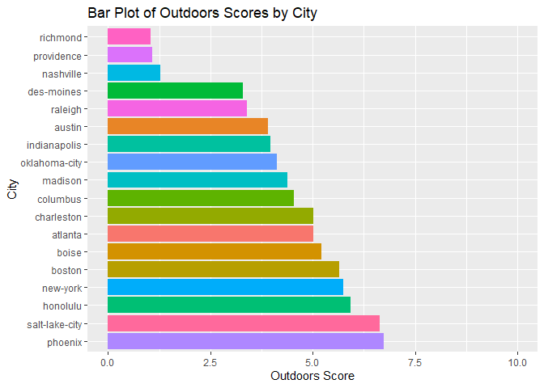

ST558 Project 2
================
Hui Fang
2023-10-04

- [1 Vignette of FoodData Central
  API](#1-vignette-of-fooddata-central-api)
  - [1.1 Introduction](#11-introduction)
  - [1.2 Packages requirements](#12-packages-requirements)
  - [1.3 Functions to query the API](#13-functions-to-query-the-api)
    - [1.3.1 Gaining Access to the API](#131-gaining-access-to-the-api)
    - [1.3.2 Develop functions to query the
      API.](#132-develop-functions-to-query-the-api)
  - [1.4 Data Exploration](#14-data-exploration)
  - [1.5 Summary](#15-summary)

``` r
library("rmarkdown")

  rmarkdown::render("Project_2_HuiFang_1.Rmd", 
            output_format = "github_document", 
            output_file = "README.md",
            output_options = list(
              name_value_pairs = "value",   
              toc = TRUE,
              toc_depth = 3, 
              number_sections = TRUE,  
              df_print = tibble
                  )
)
```

# 1 Vignette of FoodData Central API

## 1.1 Introduction

## 1.2 Packages requirements

The following `R` packages were used to create the vignette. Users are
encouraged to have these packages installed or loaded to run the
functions below. - [httr :](https://httr.r-lib.org/) For assessing the
API  
- [jsonlite
:](https://cran.r-project.org/web/packages/jsonlite/index.html) For
interacting with API - [tidyverse :](https://www.tidyverse.org/) A set
of packages for data manipulation and visualization - [knitr
:](https://cran.r-project.org/web/packages/knitr/index.html) For
friendly displaying tables in a markdown -
[kableExtra:](https://cran.r-project.org/web/packages/kableExtra/index.html)
A package for building complex HTML or ‘LaTeX’ tables.

Install and load the packages listed above:

``` r
library(httr)
library(jsonlite)
library(tidyverse)
library(knitr)
library(purrr)
library(stringr)
library(kableExtra)
```

## 1.3 Functions to query the API

### 1.3.1 Gaining Access to the API

The document serves as a vignette describing how to read and summarize
data from an [API](https://en.wikipedia.org/wiki/API). In this
demonstration, I have used the Teleport API.The [Teleport
API](https://developers.teleport.org/api/) is an integrated data system
that offers an up-to-date quality of life database for Planet Earth,
incorporating data from over 300 different dimensions from more than 70
different sources.

### 1.3.2 Develop functions to query the API.

Teleport API does not require a key for access, making it less complex
to use compared to other APIs that require a key.

#### 1.3.2.1 Create a function to retrieve median salaries of 50 countries worldwide.

``` r
# Define a list of ISO alpha-2 country codes for the 50 countries to retrieve salary data for
country_codes <- c(
  "US", "GB", "DE", "FR", "CA",  # Existing countries
  "AU", "BR", "CN", "IN", "ID",  # Add more countries as needed...
  "JP", "KR", "MX", "RU", "SA",
  "ZA", "AR", "TR", "IT", "ES",
  "EG", "NG", "PK", "BD", "VN",
  "MY", "PH", "TH", "NL", "BE",
  "SE", "NO", "DK", "FI", "IE",
  "SG", "CH", "AT", "PL", "CZ",
  "HU", "GR", "PT", "IL", "AE",
  "QA", "KW", "OM", "BH", "LB"
)

# Initialize an empty list to store salary data for each country
country_salary_data_list <- list()

# Loop through the country codes and fetch salary data for each country
for (country_code in country_codes) {
  # Define the URL for the salary data API endpoint for the current country
  url <- paste0("https://api.teleport.org/api/countries/iso_alpha2%3A", country_code, "/salaries/?embed=", country_code)
  
  # Make an HTTP GET request to retrieve salary data
  response <- GET(url)
  
  # Check if the request was successful (HTTP status code 200)
  if (httr::status_code(response) == 200) {
    # Parse the JSON response into a list or data frame
    country_salary_data <- fromJSON(content(response, "text"))
    
    # Store the salary data in the list
    country_salary_data_list[[country_code]] <- country_salary_data
  } else {
    cat("Error: Unable to fetch salary data for", country_code, "\n")
  }
}
```

#### 1.3.2.2 Creat a function to query salaries of 52 first tier cities worldwide

``` r
# Load the required libraries
library(httr)
library(jsonlite)

# Define a list of city slugs for 52 first-tier cities
first_tier_city_slugs <- c(
  "new-york", "los-angeles", "chicago", "miami", "san-francisco-bay-area",
  "london", "paris", "berlin", "madrid", "rome",
  "beijing", "shanghai", "hong-kong",
  "tokyo", "osaka", "seoul", "sydney", "melbourne",
  "mexico-city", "sao-paulo", "rio-de-janeiro", "buenos-aires", "lima",
  "moscow", "kiev", "istanbul", "ankara",
  "cairo", "dubai", "riyadh", "doha",
  "singapore", "jakarta", "bangkok", "manila",
  "toronto", "vancouver", "montreal", "calgary", "edmonton",
  "mumbai", "chennai", "hyderabad",
  "kuala-lumpur", "ho-chi-minh-city",
  "lagos", "nairobi", "johannesburg", "cape-town", "casablanca",
  "tel-aviv", "santiago"
  # Add more cities as needed...
)

# Initialize an empty list to store salary data for each city
salary_data_list <- list()

# Loop through the city slugs and fetch salary data for each city
for (city_slug in first_tier_city_slugs) {
  # Define the URL for the salary data API endpoint for the current city
  url <- paste0("https://api.teleport.org/api/urban_areas/slug:", city_slug, "/salaries/")
  
  # Make an HTTP GET request to retrieve salary data
  response <- GET(url)
  
  # Check if the request was successful (HTTP status code 200)
  if (httr::status_code(response) == 200) {
    # Parse the JSON response into a list or data frame
    salary_data <- fromJSON(content(response, "text"))
    
    # Store the salary data in the list
    salary_data_list[[city_slug]] <- salary_data
  } else {
    cat("Error: Unable to fetch salary data for", city_slug, "\n")
  }
}
```

Clean the data set of salary in from 52 first tier cities

``` r
# Initialize an empty list to store tidy salary data for each city
tidy_salary_data_list <- list()

# Loop through the cities in salary_data_list and tidy up the salary data
for (city_name in names(salary_data_list)) {
  city_data <- salary_data_list[[city_name]]
  
  if (!is.null(city_data$salaries)) {
    salaries <- city_data$salaries
    
    # Extract relevant information (e.g., job title and median salary)
    tidy_data <- data.frame(
      City = city_name,  # Use city_name as the City value
      Job_Title = salaries$job$title,
      Median_Salary = salaries$salary_percentiles$percentile_50
      # Add more columns as needed
    )
    
    tidy_salary_data_list[[city_name]] <- tidy_data
  } else {
    cat("No salary data found for", city_name, "\n")
  }
}

# Combine the tidy data for all cities into a single data frame
combined_tidy_salary_data <- do.call(rbind, tidy_salary_data_list)

# Print the first few rows of the combined tidy data frame
head(combined_tidy_salary_data)
```

#### 1.3.2.3 Visulization of 52 cities median salaries

Among the 52 first-tier cities worldwide, I conducted an analysis of the
median salaries associated with 52 distinct job titles. The figures
below showcase the top 10 job titles with the highest median salaries as
well as the 10 job titles with the lowest median salaries. This
information can serve as a valuable reference for newcomers who are
contemplating their career paths.

``` r
# Create a bar plot of the top 10 median salaries by job title
world_top_10_jobs <- combined_tidy_salary_data %>%
  group_by(Job_Title) %>%
  summarise(median_salary = median(Median_Salary, na.rm = TRUE)) %>%
  arrange(median_salary) %>%
  top_n(10)
```

    ## Selecting by median_salary

``` r
ggplot(world_top_10_jobs, aes(x = reorder(Job_Title, median_salary), y = median_salary, fill = Job_Title)) +
  geom_bar(stat = "identity") +
  labs(title = "10 Lowest Median Salaries by Job Title",
       x = "Job Title",
       y = "Median Salary") +
  theme_minimal() +
  theme(axis.text.x = element_text(angle = 0)) +
  guides(fill = "none") +  # Remove the legend
  coord_flip()  # Flip the coordinates to create a horizontal bar plot
```

<!-- -->

``` r
# Create a bar plot of the 10 lowest median salaries by job title
  world_bottom_10_jobs <- combined_tidy_salary_data %>%
  group_by(Job_Title) %>%
  summarise(median_salary = median(Median_Salary, na.rm = TRUE)) %>%
  arrange(median_salary) %>%
  slice(1:10)  # Select the bottom 10 jobs

ggplot(world_bottom_10_jobs, aes(x = reorder(Job_Title, -median_salary), y = median_salary, fill = Job_Title)) +
  geom_bar(stat = "identity") +
  labs(title = "10 Lowest Median Salaries by Job Title",
       x = "Job Title",
       y = "Median Salary") +
  theme_minimal() +
  theme(axis.text.x = element_text(angle = 0)) +
  guides(fill = "none") +  # Remove the legend
  coord_flip()  # Flip the coordinates to create a horizontal bar plot
```

<!-- --> In the
contingency table below, you can observe the distribution of job titles
in each city categorized into two groups: non-high-paying (High_pay_No),
indicating median salaries below the defined threshold of 50,000
USD/year, and high-paying (High_pay_Yes), representing median salaries
above the threshold. For instance, in Ankara, there are 47 job titles
considered non-high-paying and 5 job titles classified as high-paying
based on the specified threshold. Similarly, this table provides
insights into the breakdown of job titles as high-paying or
non-high-paying across various cities.

``` r
# Make a copy of the original data frame
high_pay_data <- combined_tidy_salary_data

# Define the threshold for high-paying jobs (e.g., median salary above a certain value)
threshold <- 50000

# Create a binary column 'High_Paying' based on the threshold
high_pay_data <- high_pay_data %>%
  mutate(High_Paying = ifelse(Median_Salary > threshold, "High_pay_Yes", "High_pay_No"))

# Capitalize the first letter of each city
high_pay_data$City <- stringr::str_to_title(high_pay_data$City)

# Create a summary table
high_paying_table <- high_pay_data %>%
  group_by(City, High_Paying) %>%
  summarise(Count = n()) %>%
  pivot_wider(names_from = High_Paying, 
              values_from = Count, 
              values_fill = 0)
```

    ## `summarise()` has grouped output by 'City'. You can override using the `.groups` argument.

``` r
# Print the summary table
head(high_paying_table)
```

#### 1.3.2.4 Creat a function to query US state capital cities available in the API

``` r
# Define a function to fetch city data
fetch_city_data <- function(city_slug) {
  # Construct the API URL for the city's quality of life data
  city_url <- paste0("https://api.teleport.org/api/urban_areas/slug:", city_slug, "/scores/")

  # Make an HTTP GET request to retrieve city data
  response <- GET(city_url)

  # Check if the request was successful (HTTP status code 200)
  status_code <- httr::status_code(response)
  
  if (status_code == 200) {
    # Parse the JSON response into a list or data frame
    city_data <- fromJSON(content(response, "text"))
    
    # Print or access the quality of life data
    print(city_data)
    
    return(city_data)
  } else {
    cat("Error: Unable to fetch quality of life data for", city_slug, "\n")
    return(NULL)
  }
}

# List of state capital city slugs (use the updated capital_cities vector)
capital_cities <- c("phoenix", "atlanta", "honolulu", "boise", "indianapolis", "des-moines", "boston",  "raleigh", "columbus", "oklahoma-city", "providence", "nashville", "austin", "salt-lake-city","new-york", "richmond", "charleston", "madison")

# Initialize an empty list to store city data
city_data_list <- list()

# Fetch data for each city
for (slug in capital_cities) {
  city_data <- fetch_city_data(slug)
  if (!is.null(city_data)) {
    city_data_list[[slug]] <- city_data
  }
}
```

    ## $`_links`
    ## $`_links`$curies
    ##                                                                               href     name templated
    ## 1       https://developers.teleport.org/api/resources/Location/#!/relations/{rel}/ location      TRUE
    ## 2           https://developers.teleport.org/api/resources/City/#!/relations/{rel}/     city      TRUE
    ## 3      https://developers.teleport.org/api/resources/UrbanArea/#!/relations/{rel}/       ua      TRUE
    ## 4        https://developers.teleport.org/api/resources/Country/#!/relations/{rel}/  country      TRUE
    ## 5 https://developers.teleport.org/api/resources/Admin1Division/#!/relations/{rel}/       a1      TRUE
    ## 6       https://developers.teleport.org/api/resources/Timezone/#!/relations/{rel}/       tz      TRUE
    ## 
    ## $`_links`$self
    ## $`_links`$self$href
    ## [1] "https://api.teleport.org/api/urban_areas/slug:phoenix/scores/"
    ## 
    ## 
    ## 
    ## $categories
    ##      color                  name score_out_of_10
    ## 1  #f3c32c               Housing        6.533000
    ## 2  #f3d630        Cost of Living        6.208000
    ## 3  #f4eb33              Startups        6.508500
    ## 4  #d2ed31       Venture Capital        4.558000
    ## 5  #7adc29   Travel Connectivity        3.302500
    ## 6  #36cc24               Commute        4.828500
    ## 7  #19ad51      Business Freedom        8.671000
    ## 8  #0d6999                Safety        2.583000
    ## 9  #051fa5            Healthcare        8.567333
    ## 10 #150e78             Education        4.591000
    ## 11 #3d14a4 Environmental Quality        4.625250
    ## 12 #5c14a1               Economy        6.514500
    ## 13 #88149f              Taxation        4.488000
    ## 14 #b9117d       Internet Access        6.178000
    ## 15 #d10d54     Leisure & Culture        6.810000
    ## 16 #e70c26             Tolerance        5.565000
    ## 17 #f1351b              Outdoors        6.735500
    ## 
    ## $summary
    ## [1] "<p>Phoenix, Arizona, is among the top cities with a <b>free business environment</b>.\n\n    \n        According to our city rankings, this is a good place to live with high ratings in <b>healthcare</b>, <b>leisure & culture</b> and <b>outdoors</b>.\n    \n\n    \n</p>\n\n\n    <p>Phoenix is one of the top ten city matches for 0.2% of Teleport users.</p>\n"
    ## 
    ## $teleport_city_score
    ## [1] 56.66257
    ## 
    ## $`_links`
    ## $`_links`$curies
    ##                                                                               href     name templated
    ## 1       https://developers.teleport.org/api/resources/Location/#!/relations/{rel}/ location      TRUE
    ## 2           https://developers.teleport.org/api/resources/City/#!/relations/{rel}/     city      TRUE
    ## 3      https://developers.teleport.org/api/resources/UrbanArea/#!/relations/{rel}/       ua      TRUE
    ## 4        https://developers.teleport.org/api/resources/Country/#!/relations/{rel}/  country      TRUE
    ## 5 https://developers.teleport.org/api/resources/Admin1Division/#!/relations/{rel}/       a1      TRUE
    ## 6       https://developers.teleport.org/api/resources/Timezone/#!/relations/{rel}/       tz      TRUE
    ## 
    ## $`_links`$self
    ## $`_links`$self$href
    ## [1] "https://api.teleport.org/api/urban_areas/slug:atlanta/scores/"
    ## 
    ## 
    ## 
    ## $categories
    ##      color                  name score_out_of_10
    ## 1  #f3c32c               Housing         4.97550
    ## 2  #f3d630        Cost of Living         5.24100
    ## 3  #f4eb33              Startups         8.83500
    ## 4  #d2ed31       Venture Capital         7.25700
    ## 5  #7adc29   Travel Connectivity         5.29150
    ## 6  #36cc24               Commute         3.89775
    ## 7  #19ad51      Business Freedom         8.67100
    ## 8  #0d6999                Safety         2.67250
    ## 9  #051fa5            Healthcare         8.53400
    ## 10 #150e78             Education         6.45700
    ## 11 #3d14a4 Environmental Quality         5.81775
    ## 12 #5c14a1               Economy         6.51450
    ## 13 #88149f              Taxation         4.20400
    ## 14 #b9117d       Internet Access         6.48050
    ## 15 #d10d54     Leisure & Culture         7.76550
    ## 16 #e70c26             Tolerance         4.06200
    ## 17 #f1351b              Outdoors         5.00950
    ## 
    ## $summary
    ## [1] "<p>Atlanta, Georgia, is among the best cities with a <b>vibrant startup scene</b>.\n\n    \n        According to our city rankings, this is a good place to live with high ratings in <b>venture capital</b>, <b>business freedom</b> and <b>healthcare</b>.\n    \n\n    \n</p>\n\n\n    <p>Atlanta is one of the top ten city matches for 6.5% of Teleport users.</p>\n"
    ## 
    ## $teleport_city_score
    ## [1] 58.03757
    ## 
    ## $`_links`
    ## $`_links`$curies
    ##                                                                               href     name templated
    ## 1       https://developers.teleport.org/api/resources/Location/#!/relations/{rel}/ location      TRUE
    ## 2           https://developers.teleport.org/api/resources/City/#!/relations/{rel}/     city      TRUE
    ## 3      https://developers.teleport.org/api/resources/UrbanArea/#!/relations/{rel}/       ua      TRUE
    ## 4        https://developers.teleport.org/api/resources/Country/#!/relations/{rel}/  country      TRUE
    ## 5 https://developers.teleport.org/api/resources/Admin1Division/#!/relations/{rel}/       a1      TRUE
    ## 6       https://developers.teleport.org/api/resources/Timezone/#!/relations/{rel}/       tz      TRUE
    ## 
    ## $`_links`$self
    ## $`_links`$self$href
    ## [1] "https://api.teleport.org/api/urban_areas/slug:honolulu/scores/"
    ## 
    ## 
    ## 
    ## $categories
    ##      color                  name score_out_of_10
    ## 1  #f3c32c               Housing         2.34150
    ## 2  #f3d630        Cost of Living         2.86700
    ## 3  #f4eb33              Startups         4.13350
    ## 4  #d2ed31       Venture Capital         0.00000
    ## 5  #7adc29   Travel Connectivity         1.98300
    ## 6  #36cc24               Commute         4.16175
    ## 7  #19ad51      Business Freedom         8.67100
    ## 8  #0d6999                Safety         6.85650
    ## 9  #051fa5            Healthcare         8.47400
    ## 10 #150e78             Education         4.28050
    ## 11 #3d14a4 Environmental Quality         6.09400
    ## 12 #5c14a1               Economy         6.51450
    ## 13 #88149f              Taxation         4.20400
    ## 14 #b9117d       Internet Access         6.15800
    ## 15 #d10d54     Leisure & Culture         7.62300
    ## 16 #e70c26             Tolerance         7.77400
    ## 17 #f1351b              Outdoors         5.91750
    ## 
    ## $summary
    ## [1] "<p>Honolulu, Hawaii, is among the top cities with a <b>free business environment</b>.\n\n    \n        According to our city rankings, this is a good place to live with high ratings in <b>safety</b>, <b>healthcare</b> and <b>leisure & culture</b>.\n    \n\n    \n</p>\n\n"
    ## 
    ## $teleport_city_score
    ## [1] 55.74703
    ## 
    ## $`_links`
    ## $`_links`$curies
    ##                                                                               href     name templated
    ## 1       https://developers.teleport.org/api/resources/Location/#!/relations/{rel}/ location      TRUE
    ## 2           https://developers.teleport.org/api/resources/City/#!/relations/{rel}/     city      TRUE
    ## 3      https://developers.teleport.org/api/resources/UrbanArea/#!/relations/{rel}/       ua      TRUE
    ## 4        https://developers.teleport.org/api/resources/Country/#!/relations/{rel}/  country      TRUE
    ## 5 https://developers.teleport.org/api/resources/Admin1Division/#!/relations/{rel}/       a1      TRUE
    ## 6       https://developers.teleport.org/api/resources/Timezone/#!/relations/{rel}/       tz      TRUE
    ## 
    ## $`_links`$self
    ## $`_links`$self$href
    ## [1] "https://api.teleport.org/api/urban_areas/slug:boise/scores/"
    ## 
    ## 
    ## 
    ## $categories
    ##      color                  name score_out_of_10
    ## 1  #f3c32c               Housing          6.9635
    ## 2  #f3d630        Cost of Living          6.5780
    ## 3  #f4eb33              Startups          4.2050
    ## 4  #d2ed31       Venture Capital          2.5960
    ## 5  #7adc29   Travel Connectivity          1.3235
    ## 6  #36cc24               Commute          5.2250
    ## 7  #19ad51      Business Freedom          8.6710
    ## 8  #0d6999                Safety          4.3605
    ## 9  #051fa5            Healthcare          8.8810
    ## 10 #150e78             Education          3.6245
    ## 11 #3d14a4 Environmental Quality          8.0695
    ## 12 #5c14a1               Economy          6.5145
    ## 13 #88149f              Taxation          4.0620
    ## 14 #b9117d       Internet Access          3.4420
    ## 15 #d10d54     Leisure & Culture          4.1995
    ## 16 #e70c26             Tolerance          6.9275
    ## 17 #f1351b              Outdoors          5.2210
    ## 
    ## $summary
    ## [1] "<p>Boise, Idaho, is among the top cities with a <b>free business environment</b>.\n\n    \n        According to our city rankings, this is a good place to live with high ratings in <b>housing</b>, <b>healthcare</b> and <b>environmental quality</b>.\n    \n\n    \n</p>\n\n"
    ## 
    ## $teleport_city_score
    ## [1] 55.63108
    ## 
    ## $`_links`
    ## $`_links`$curies
    ##                                                                               href     name templated
    ## 1       https://developers.teleport.org/api/resources/Location/#!/relations/{rel}/ location      TRUE
    ## 2           https://developers.teleport.org/api/resources/City/#!/relations/{rel}/     city      TRUE
    ## 3      https://developers.teleport.org/api/resources/UrbanArea/#!/relations/{rel}/       ua      TRUE
    ## 4        https://developers.teleport.org/api/resources/Country/#!/relations/{rel}/  country      TRUE
    ## 5 https://developers.teleport.org/api/resources/Admin1Division/#!/relations/{rel}/       a1      TRUE
    ## 6       https://developers.teleport.org/api/resources/Timezone/#!/relations/{rel}/       tz      TRUE
    ## 
    ## $`_links`$self
    ## $`_links`$self$href
    ## [1] "https://api.teleport.org/api/urban_areas/slug:indianapolis/scores/"
    ## 
    ## 
    ## 
    ## $categories
    ##      color                  name score_out_of_10
    ## 1  #f3c32c               Housing        6.266000
    ## 2  #f3d630        Cost of Living        5.478000
    ## 3  #f4eb33              Startups        5.503000
    ## 4  #d2ed31       Venture Capital        3.960000
    ## 5  #7adc29   Travel Connectivity        1.681500
    ## 6  #36cc24               Commute        4.858750
    ## 7  #19ad51      Business Freedom        8.671000
    ## 8  #0d6999                Safety        3.968000
    ## 9  #051fa5            Healthcare        8.597667
    ## 10 #150e78             Education        3.624500
    ## 11 #3d14a4 Environmental Quality        6.160500
    ## 12 #5c14a1               Economy        6.514500
    ## 13 #88149f              Taxation        4.062000
    ## 14 #b9117d       Internet Access        5.875500
    ## 15 #d10d54     Leisure & Culture        7.299000
    ## 16 #e70c26             Tolerance        6.870000
    ## 17 #f1351b              Outdoors        3.965000
    ## 
    ## $summary
    ## [1] "<p>Indianapolis, Indiana, is among the top cities with a <b>free business environment</b>.\n\n    \n        According to our city rankings, this is a good place to live with high ratings in <b>healthcare</b>, <b>leisure & culture</b> and <b>tolerance</b>.\n    \n\n    \n</p>\n\n"
    ## 
    ## $teleport_city_score
    ## [1] 55.76176
    ## 
    ## $`_links`
    ## $`_links`$curies
    ##                                                                               href     name templated
    ## 1       https://developers.teleport.org/api/resources/Location/#!/relations/{rel}/ location      TRUE
    ## 2           https://developers.teleport.org/api/resources/City/#!/relations/{rel}/     city      TRUE
    ## 3      https://developers.teleport.org/api/resources/UrbanArea/#!/relations/{rel}/       ua      TRUE
    ## 4        https://developers.teleport.org/api/resources/Country/#!/relations/{rel}/  country      TRUE
    ## 5 https://developers.teleport.org/api/resources/Admin1Division/#!/relations/{rel}/       a1      TRUE
    ## 6       https://developers.teleport.org/api/resources/Timezone/#!/relations/{rel}/       tz      TRUE
    ## 
    ## $`_links`$self
    ## $`_links`$self$href
    ## [1] "https://api.teleport.org/api/urban_areas/slug:des-moines/scores/"
    ## 
    ## 
    ## 
    ## $categories
    ##      color                  name score_out_of_10
    ## 1  #f3c32c               Housing        6.851000
    ## 2  #f3d630        Cost of Living        6.327000
    ## 3  #f4eb33              Startups        2.912000
    ## 4  #d2ed31       Venture Capital        1.818000
    ## 5  #7adc29   Travel Connectivity        1.379000
    ## 6  #36cc24               Commute        2.072250
    ## 7  #19ad51      Business Freedom        8.671000
    ## 8  #0d6999                Safety        6.984000
    ## 9  #051fa5            Healthcare        8.841333
    ## 10 #150e78             Education        3.624500
    ## 11 #3d14a4 Environmental Quality        8.682250
    ## 12 #5c14a1               Economy        6.514500
    ## 13 #88149f              Taxation        4.346000
    ## 14 #b9117d       Internet Access        5.698000
    ## 15 #d10d54     Leisure & Culture        6.066500
    ## 16 #e70c26             Tolerance        8.476500
    ## 17 #f1351b              Outdoors        3.299500
    ## 
    ## $summary
    ## [1] "<p>Des Moines, Iowa, is characterized by a <b>clean environment</b>.\n\n    \n        According to our city rankings, this is a good place to live with high ratings in <b>housing</b>, <b>business freedom</b> and <b>safety</b>.\n    \n\n    \n</p>\n\n"
    ## 
    ## $teleport_city_score
    ## [1] 55.92122
    ## 
    ## $`_links`
    ## $`_links`$curies
    ##                                                                               href     name templated
    ## 1       https://developers.teleport.org/api/resources/Location/#!/relations/{rel}/ location      TRUE
    ## 2           https://developers.teleport.org/api/resources/City/#!/relations/{rel}/     city      TRUE
    ## 3      https://developers.teleport.org/api/resources/UrbanArea/#!/relations/{rel}/       ua      TRUE
    ## 4        https://developers.teleport.org/api/resources/Country/#!/relations/{rel}/  country      TRUE
    ## 5 https://developers.teleport.org/api/resources/Admin1Division/#!/relations/{rel}/       a1      TRUE
    ## 6       https://developers.teleport.org/api/resources/Timezone/#!/relations/{rel}/       tz      TRUE
    ## 
    ## $`_links`$self
    ## $`_links`$self$href
    ## [1] "https://api.teleport.org/api/urban_areas/slug:boston/scores/"
    ## 
    ## 
    ## 
    ## $categories
    ##      color                  name score_out_of_10
    ## 1  #f3c32c               Housing         1.00000
    ## 2  #f3d630        Cost of Living         4.25900
    ## 3  #f4eb33              Startups         9.56500
    ## 4  #d2ed31       Venture Capital        10.00000
    ## 5  #7adc29   Travel Connectivity         3.21500
    ## 6  #36cc24               Commute         4.39625
    ## 7  #19ad51      Business Freedom         8.67100
    ## 8  #0d6999                Safety         7.74200
    ## 9  #051fa5            Healthcare         8.95600
    ## 10 #150e78             Education         8.62450
    ## 11 #3d14a4 Environmental Quality         8.17050
    ## 12 #5c14a1               Economy         6.51450
    ## 13 #88149f              Taxation         4.06200
    ## 14 #b9117d       Internet Access         5.70050
    ## 15 #d10d54     Leisure & Culture         8.56400
    ## 16 #e70c26             Tolerance         8.48150
    ## 17 #f1351b              Outdoors         5.66000
    ## 
    ## $summary
    ## [1] "<p>\n    One of the oldest and most historic cities in the US, Boston is a center of higher education with some of the <b>top universities</b> in the world. It has also developed a vibrant technology scene and is home to numerous <b>venture capital</b> firms, all supporting high rates of innovation and entrepreneurship. Add its <b>tolerant</b> environment, great quality of <b>healthcare</b> and beautiful New England nature, and you've got an enticing city that attracts talent from around the world.\n</p>\n\n\n    <p>Boston is one of the top ten city matches for 12.8% of Teleport users.</p>\n"
    ## 
    ## $teleport_city_score
    ## [1] 67.32635
    ## 
    ## $`_links`
    ## $`_links`$curies
    ##                                                                               href     name templated
    ## 1       https://developers.teleport.org/api/resources/Location/#!/relations/{rel}/ location      TRUE
    ## 2           https://developers.teleport.org/api/resources/City/#!/relations/{rel}/     city      TRUE
    ## 3      https://developers.teleport.org/api/resources/UrbanArea/#!/relations/{rel}/       ua      TRUE
    ## 4        https://developers.teleport.org/api/resources/Country/#!/relations/{rel}/  country      TRUE
    ## 5 https://developers.teleport.org/api/resources/Admin1Division/#!/relations/{rel}/       a1      TRUE
    ## 6       https://developers.teleport.org/api/resources/Timezone/#!/relations/{rel}/       tz      TRUE
    ## 
    ## $`_links`$self
    ## $`_links`$self$href
    ## [1] "https://api.teleport.org/api/urban_areas/slug:raleigh/scores/"
    ## 
    ## 
    ## 
    ## $categories
    ##      color                  name score_out_of_10
    ## 1  #f3c32c               Housing        6.128500
    ## 2  #f3d630        Cost of Living        5.610000
    ## 3  #f4eb33              Startups        5.497000
    ## 4  #d2ed31       Venture Capital        5.157000
    ## 5  #7adc29   Travel Connectivity        1.757000
    ## 6  #36cc24               Commute        4.784250
    ## 7  #19ad51      Business Freedom        8.671000
    ## 8  #0d6999                Safety        6.522500
    ## 9  #051fa5            Healthcare        8.966667
    ## 10 #150e78             Education        7.116500
    ## 11 #3d14a4 Environmental Quality        8.583750
    ## 12 #5c14a1               Economy        6.514500
    ## 13 #88149f              Taxation        4.062000
    ## 14 #b9117d       Internet Access        7.951500
    ## 15 #d10d54     Leisure & Culture        6.613000
    ## 16 #e70c26             Tolerance        7.562000
    ## 17 #f1351b              Outdoors        3.390500
    ## 
    ## $summary
    ## [1] "<p>Raleigh, North Carolina, is among the top cities with a <b>free business environment</b>.\n\n    \n        According to our city rankings, this is a good place to live with high ratings in <b>healthcare</b>, <b>education</b> and <b>environmental quality</b>.\n    \n\n    \n</p>\n\n\n    <p>Raleigh is one of the top ten city matches for 3.4% of Teleport users.</p>\n"
    ## 
    ## $teleport_city_score
    ## [1] 62.51568
    ## 
    ## $`_links`
    ## $`_links`$curies
    ##                                                                               href     name templated
    ## 1       https://developers.teleport.org/api/resources/Location/#!/relations/{rel}/ location      TRUE
    ## 2           https://developers.teleport.org/api/resources/City/#!/relations/{rel}/     city      TRUE
    ## 3      https://developers.teleport.org/api/resources/UrbanArea/#!/relations/{rel}/       ua      TRUE
    ## 4        https://developers.teleport.org/api/resources/Country/#!/relations/{rel}/  country      TRUE
    ## 5 https://developers.teleport.org/api/resources/Admin1Division/#!/relations/{rel}/       a1      TRUE
    ## 6       https://developers.teleport.org/api/resources/Timezone/#!/relations/{rel}/       tz      TRUE
    ## 
    ## $`_links`$self
    ## $`_links`$self$href
    ## [1] "https://api.teleport.org/api/urban_areas/slug:columbus/scores/"
    ## 
    ## 
    ## 
    ## $categories
    ##      color                  name score_out_of_10
    ## 1  #f3c32c               Housing         6.28950
    ## 2  #f3d630        Cost of Living         5.74600
    ## 3  #f4eb33              Startups         5.87850
    ## 4  #d2ed31       Venture Capital         4.97300
    ## 5  #7adc29   Travel Connectivity         1.66300
    ## 6  #36cc24               Commute         5.02675
    ## 7  #19ad51      Business Freedom         8.67100
    ## 8  #0d6999                Safety         5.28150
    ## 9  #051fa5            Healthcare         8.68900
    ## 10 #150e78             Education         5.04750
    ## 11 #3d14a4 Environmental Quality         8.16600
    ## 12 #5c14a1               Economy         6.51450
    ## 13 #88149f              Taxation         3.92050
    ## 14 #b9117d       Internet Access         4.55350
    ## 15 #d10d54     Leisure & Culture         6.46600
    ## 16 #e70c26             Tolerance         5.92150
    ## 17 #f1351b              Outdoors         4.54500
    ## 
    ## $summary
    ## [1] "<p>Columbus, Ohio, is among the top cities with a <b>free business environment</b>.\n\n    \n        Our data reflects that this city has a good ranking in <b>healthcare</b> and <b>environmental quality</b>.\n    \n\n    \n</p>\n\n\n    <p>Columbus is one of the top ten city matches for 0.9% of Teleport users.</p>\n"
    ## 
    ## $teleport_city_score
    ## [1] 58.75932
    ## 
    ## $`_links`
    ## $`_links`$curies
    ##                                                                               href     name templated
    ## 1       https://developers.teleport.org/api/resources/Location/#!/relations/{rel}/ location      TRUE
    ## 2           https://developers.teleport.org/api/resources/City/#!/relations/{rel}/     city      TRUE
    ## 3      https://developers.teleport.org/api/resources/UrbanArea/#!/relations/{rel}/       ua      TRUE
    ## 4        https://developers.teleport.org/api/resources/Country/#!/relations/{rel}/  country      TRUE
    ## 5 https://developers.teleport.org/api/resources/Admin1Division/#!/relations/{rel}/       a1      TRUE
    ## 6       https://developers.teleport.org/api/resources/Timezone/#!/relations/{rel}/       tz      TRUE
    ## 
    ## $`_links`$self
    ## $`_links`$self$href
    ## [1] "https://api.teleport.org/api/urban_areas/slug:oklahoma-city/scores/"
    ## 
    ## 
    ## 
    ## $categories
    ##      color                  name score_out_of_10
    ## 1  #f3c32c               Housing         7.26100
    ## 2  #f3d630        Cost of Living         6.39400
    ## 3  #f4eb33              Startups         4.13750
    ## 4  #d2ed31       Venture Capital         0.00000
    ## 5  #7adc29   Travel Connectivity         1.39900
    ## 6  #36cc24               Commute         5.02725
    ## 7  #19ad51      Business Freedom         8.67100
    ## 8  #0d6999                Safety         4.68550
    ## 9  #051fa5            Healthcare         8.54900
    ## 10 #150e78             Education         3.62450
    ## 11 #3d14a4 Environmental Quality         7.61525
    ## 12 #5c14a1               Economy         6.51450
    ## 13 #88149f              Taxation         4.20400
    ## 14 #b9117d       Internet Access         7.68900
    ## 15 #d10d54     Leisure & Culture         5.37600
    ## 16 #e70c26             Tolerance         6.02200
    ## 17 #f1351b              Outdoors         4.12900
    ## 
    ## $summary
    ## [1] "<p>Oklahoma City, Oklahoma, is among the top cities with a <b>free business environment</b>.\n\n    \n        According to our city rankings, this is a good place to live with high ratings in <b>housing</b>, <b>healthcare</b> and <b>environmental quality</b>.\n    \n\n    \n</p>\n\n\n    <p>Oklahoma City is one of the top ten city matches for 1.6% of Teleport users.</p>\n"
    ## 
    ## $teleport_city_score
    ## [1] 55.44851
    ## 
    ## $`_links`
    ## $`_links`$curies
    ##                                                                               href     name templated
    ## 1       https://developers.teleport.org/api/resources/Location/#!/relations/{rel}/ location      TRUE
    ## 2           https://developers.teleport.org/api/resources/City/#!/relations/{rel}/     city      TRUE
    ## 3      https://developers.teleport.org/api/resources/UrbanArea/#!/relations/{rel}/       ua      TRUE
    ## 4        https://developers.teleport.org/api/resources/Country/#!/relations/{rel}/  country      TRUE
    ## 5 https://developers.teleport.org/api/resources/Admin1Division/#!/relations/{rel}/       a1      TRUE
    ## 6       https://developers.teleport.org/api/resources/Timezone/#!/relations/{rel}/       tz      TRUE
    ## 
    ## $`_links`$self
    ## $`_links`$self$href
    ## [1] "https://api.teleport.org/api/urban_areas/slug:providence/scores/"
    ## 
    ## 
    ## 
    ## $categories
    ##      color                  name score_out_of_10
    ## 1  #f3c32c               Housing        3.153000
    ## 2  #f3d630        Cost of Living        0.000000
    ## 3  #f4eb33              Startups        3.764000
    ## 4  #d2ed31       Venture Capital        1.000000
    ## 5  #7adc29   Travel Connectivity        3.018500
    ## 6  #36cc24               Commute        2.422000
    ## 7  #19ad51      Business Freedom        8.671000
    ## 8  #0d6999                Safety        6.846000
    ## 9  #051fa5            Healthcare        8.885333
    ## 10 #150e78             Education        5.301500
    ## 11 #3d14a4 Environmental Quality        5.900500
    ## 12 #5c14a1               Economy        6.514500
    ## 13 #88149f              Taxation        4.204000
    ## 14 #b9117d       Internet Access        8.934500
    ## 15 #d10d54     Leisure & Culture        3.918500
    ## 16 #e70c26             Tolerance        7.490000
    ## 17 #f1351b              Outdoors        1.084000
    ## 
    ## $summary
    ## [1] "<p>Providence, Rhode Island, is among the leading cities with a <b>speedy internet access</b>.\n\n    \n        According to our city rankings, this is a good place to live with high ratings in <b>business freedom</b>, <b>safety</b> and <b>healthcare</b>.\n    \n\n    \n</p>\n\n"
    ## 
    ## $teleport_city_score
    ## [1] 50.91149
    ## 
    ## $`_links`
    ## $`_links`$curies
    ##                                                                               href     name templated
    ## 1       https://developers.teleport.org/api/resources/Location/#!/relations/{rel}/ location      TRUE
    ## 2           https://developers.teleport.org/api/resources/City/#!/relations/{rel}/     city      TRUE
    ## 3      https://developers.teleport.org/api/resources/UrbanArea/#!/relations/{rel}/       ua      TRUE
    ## 4        https://developers.teleport.org/api/resources/Country/#!/relations/{rel}/  country      TRUE
    ## 5 https://developers.teleport.org/api/resources/Admin1Division/#!/relations/{rel}/       a1      TRUE
    ## 6       https://developers.teleport.org/api/resources/Timezone/#!/relations/{rel}/       tz      TRUE
    ## 
    ## $`_links`$self
    ## $`_links`$self$href
    ## [1] "https://api.teleport.org/api/urban_areas/slug:nashville/scores/"
    ## 
    ## 
    ## 
    ## $categories
    ##      color                  name score_out_of_10
    ## 1  #f3c32c               Housing        4.454500
    ## 2  #f3d630        Cost of Living        5.742000
    ## 3  #f4eb33              Startups        6.060000
    ## 4  #d2ed31       Venture Capital        3.569000
    ## 5  #7adc29   Travel Connectivity        1.908000
    ## 6  #36cc24               Commute        4.501000
    ## 7  #19ad51      Business Freedom        8.671000
    ## 8  #0d6999                Safety        5.078000
    ## 9  #051fa5            Healthcare        8.370333
    ## 10 #150e78             Education        4.733000
    ## 11 #3d14a4 Environmental Quality        7.056500
    ## 12 #5c14a1               Economy        6.514500
    ## 13 #88149f              Taxation        4.772000
    ## 14 #b9117d       Internet Access        6.637000
    ## 15 #d10d54     Leisure & Culture        7.020000
    ## 16 #e70c26             Tolerance        6.807500
    ## 17 #f1351b              Outdoors        1.273500
    ## 
    ## $summary
    ## [1] "<p>Nashville, Tennessee, is among the top cities with a <b>free business environment</b>.\n\n    \n        According to our city rankings, this is a good place to live with high ratings in <b>healthcare</b>, <b>environmental quality</b> and <b>internet access</b>.\n    \n\n    \n</p>\n\n\n    <p>Nashville is one of the top ten city matches for 0.3% of Teleport users.</p>\n"
    ## 
    ## $teleport_city_score
    ## [1] 55.83432
    ## 
    ## $`_links`
    ## $`_links`$curies
    ##                                                                               href     name templated
    ## 1       https://developers.teleport.org/api/resources/Location/#!/relations/{rel}/ location      TRUE
    ## 2           https://developers.teleport.org/api/resources/City/#!/relations/{rel}/     city      TRUE
    ## 3      https://developers.teleport.org/api/resources/UrbanArea/#!/relations/{rel}/       ua      TRUE
    ## 4        https://developers.teleport.org/api/resources/Country/#!/relations/{rel}/  country      TRUE
    ## 5 https://developers.teleport.org/api/resources/Admin1Division/#!/relations/{rel}/       a1      TRUE
    ## 6       https://developers.teleport.org/api/resources/Timezone/#!/relations/{rel}/       tz      TRUE
    ## 
    ## $`_links`$self
    ## $`_links`$self$href
    ## [1] "https://api.teleport.org/api/urban_areas/slug:austin/scores/"
    ## 
    ## 
    ## 
    ## $categories
    ##      color                  name score_out_of_10
    ## 1  #f3c32c               Housing        4.334500
    ## 2  #f3d630        Cost of Living        5.355000
    ## 3  #f4eb33              Startups        9.236000
    ## 4  #d2ed31       Venture Capital        6.939000
    ## 5  #7adc29   Travel Connectivity        1.851500
    ## 6  #36cc24               Commute        4.330500
    ## 7  #19ad51      Business Freedom        8.671000
    ## 8  #0d6999                Safety        5.069000
    ## 9  #051fa5            Healthcare        8.686667
    ## 10 #150e78             Education        5.315000
    ## 11 #3d14a4 Environmental Quality        7.030750
    ## 12 #5c14a1               Economy        6.514500
    ## 13 #88149f              Taxation        4.772000
    ## 14 #b9117d       Internet Access        9.049000
    ## 15 #d10d54     Leisure & Culture        6.698000
    ## 16 #e70c26             Tolerance        6.789500
    ## 17 #f1351b              Outdoors        3.909000
    ## 
    ## $summary
    ## [1] "<p>Austin, Texas, is among the best cities with a <b>vibrant startup scene</b>.\n\n    \n        According to our city rankings, this is a good place to live with high ratings in <b>venture capital</b>, <b>business freedom</b> and <b>healthcare</b>.\n    \n\n    \n</p>\n\n\n    <p>Austin is one of the top ten city matches for 9.0% of Teleport users.</p>\n"
    ## 
    ## $teleport_city_score
    ## [1] 60.5177
    ## 
    ## $`_links`
    ## $`_links`$curies
    ##                                                                               href     name templated
    ## 1       https://developers.teleport.org/api/resources/Location/#!/relations/{rel}/ location      TRUE
    ## 2           https://developers.teleport.org/api/resources/City/#!/relations/{rel}/     city      TRUE
    ## 3      https://developers.teleport.org/api/resources/UrbanArea/#!/relations/{rel}/       ua      TRUE
    ## 4        https://developers.teleport.org/api/resources/Country/#!/relations/{rel}/  country      TRUE
    ## 5 https://developers.teleport.org/api/resources/Admin1Division/#!/relations/{rel}/       a1      TRUE
    ## 6       https://developers.teleport.org/api/resources/Timezone/#!/relations/{rel}/       tz      TRUE
    ## 
    ## $`_links`$self
    ## $`_links`$self$href
    ## [1] "https://api.teleport.org/api/urban_areas/slug:salt-lake-city/scores/"
    ## 
    ## 
    ## 
    ## $categories
    ##      color                  name score_out_of_10
    ## 1  #f3c32c               Housing        6.141000
    ## 2  #f3d630        Cost of Living        6.172000
    ## 3  #f4eb33              Startups        6.300000
    ## 4  #d2ed31       Venture Capital        7.090000
    ## 5  #7adc29   Travel Connectivity        2.737000
    ## 6  #36cc24               Commute        4.574000
    ## 7  #19ad51      Business Freedom        8.671000
    ## 8  #0d6999                Safety        5.657000
    ## 9  #051fa5            Healthcare        8.818667
    ## 10 #150e78             Education        4.280500
    ## 11 #3d14a4 Environmental Quality        6.215750
    ## 12 #5c14a1               Economy        6.514500
    ## 13 #88149f              Taxation        4.204000
    ## 14 #b9117d       Internet Access        6.810500
    ## 15 #d10d54     Leisure & Culture        5.932000
    ## 16 #e70c26             Tolerance        8.622500
    ## 17 #f1351b              Outdoors        6.641000
    ## 
    ## $summary
    ## [1] "<p>Salt Lake City, Utah, is among the top cities with a <b>free business environment</b>.\n\n    \n        According to our city rankings, this is a good place to live with high ratings in <b>venture capital</b>, <b>healthcare</b> and <b>internet access</b>.\n    \n\n    \n</p>\n\n\n    <p>Salt Lake City is one of the top ten city matches for 2.4% of Teleport users.</p>\n"
    ## 
    ## $teleport_city_score
    ## [1] 61.79514
    ## 
    ## $`_links`
    ## $`_links`$curies
    ##                                                                               href     name templated
    ## 1       https://developers.teleport.org/api/resources/Location/#!/relations/{rel}/ location      TRUE
    ## 2           https://developers.teleport.org/api/resources/City/#!/relations/{rel}/     city      TRUE
    ## 3      https://developers.teleport.org/api/resources/UrbanArea/#!/relations/{rel}/       ua      TRUE
    ## 4        https://developers.teleport.org/api/resources/Country/#!/relations/{rel}/  country      TRUE
    ## 5 https://developers.teleport.org/api/resources/Admin1Division/#!/relations/{rel}/       a1      TRUE
    ## 6       https://developers.teleport.org/api/resources/Timezone/#!/relations/{rel}/       tz      TRUE
    ## 
    ## $`_links`$self
    ## $`_links`$self$href
    ## [1] "https://api.teleport.org/api/urban_areas/slug:new-york/scores/"
    ## 
    ## 
    ## 
    ## $categories
    ##      color                  name score_out_of_10
    ## 1  #f3c32c               Housing        1.000000
    ## 2  #f3d630        Cost of Living        2.342000
    ## 3  #f4eb33              Startups       10.000000
    ## 4  #d2ed31       Venture Capital       10.000000
    ## 5  #7adc29   Travel Connectivity        6.675000
    ## 6  #36cc24               Commute        5.519250
    ## 7  #19ad51      Business Freedom        8.671000
    ## 8  #0d6999                Safety        7.022000
    ## 9  #051fa5            Healthcare        8.501667
    ## 10 #150e78             Education        8.093500
    ## 11 #3d14a4 Environmental Quality        5.233750
    ## 12 #5c14a1               Economy        6.514500
    ## 13 #88149f              Taxation        3.920500
    ## 14 #b9117d       Internet Access        7.098500
    ## 15 #d10d54     Leisure & Culture       10.000000
    ## 16 #e70c26             Tolerance        6.712500
    ## 17 #f1351b              Outdoors        5.747500
    ## 
    ## $summary
    ## [1] "<p>\n    The New York metropolitan area is one of the most populated cities in the world. New York City itself is an <b>international center for numerous industries</b> including finance, theater, television, film, arts, and technology. It is also home to an astonishing 37% of foreign-born residents. Costs are high, but so are the energy levels and <b>ambitious spirit</b>. Whether you're visiting or planning to move, the \"Big Apple\" has <b>something to offer for everyone</b>.\n</p>\n\n\n    <p>New York is one of the top ten city matches for 13.9% of Teleport users.</p>\n"
    ## 
    ## $teleport_city_score
    ## [1] 67.27514
    ## 
    ## $`_links`
    ## $`_links`$curies
    ##                                                                               href     name templated
    ## 1       https://developers.teleport.org/api/resources/Location/#!/relations/{rel}/ location      TRUE
    ## 2           https://developers.teleport.org/api/resources/City/#!/relations/{rel}/     city      TRUE
    ## 3      https://developers.teleport.org/api/resources/UrbanArea/#!/relations/{rel}/       ua      TRUE
    ## 4        https://developers.teleport.org/api/resources/Country/#!/relations/{rel}/  country      TRUE
    ## 5 https://developers.teleport.org/api/resources/Admin1Division/#!/relations/{rel}/       a1      TRUE
    ## 6       https://developers.teleport.org/api/resources/Timezone/#!/relations/{rel}/       tz      TRUE
    ## 
    ## $`_links`$self
    ## $`_links`$self$href
    ## [1] "https://api.teleport.org/api/urban_areas/slug:richmond/scores/"
    ## 
    ## 
    ## 
    ## $categories
    ##      color                  name score_out_of_10
    ## 1  #f3c32c               Housing        6.439500
    ## 2  #f3d630        Cost of Living        5.949000
    ## 3  #f4eb33              Startups        4.270500
    ## 4  #d2ed31       Venture Capital        2.097000
    ## 5  #7adc29   Travel Connectivity        1.380000
    ## 6  #36cc24               Commute        5.648500
    ## 7  #19ad51      Business Freedom        8.671000
    ## 8  #0d6999                Safety        3.376500
    ## 9  #051fa5            Healthcare        8.855333
    ## 10 #150e78             Education        3.624500
    ## 11 #3d14a4 Environmental Quality        6.621750
    ## 12 #5c14a1               Economy        6.514500
    ## 13 #88149f              Taxation        4.204000
    ## 14 #b9117d       Internet Access        7.645500
    ## 15 #d10d54     Leisure & Culture        6.338500
    ## 16 #e70c26             Tolerance        7.151000
    ## 17 #f1351b              Outdoors        1.035000
    ## 
    ## $summary
    ## [1] "<p>Richmond, Virginia, is among the top cities with a <b>free business environment</b>.\n\n    \n        According to our city rankings, this is a good place to live with high ratings in <b>healthcare</b>, <b>environmental quality</b> and <b>internet access</b>.\n    \n\n    \n</p>\n\n"
    ## 
    ## $teleport_city_score
    ## [1] 53.92676
    ## 
    ## $`_links`
    ## $`_links`$curies
    ##                                                                               href     name templated
    ## 1       https://developers.teleport.org/api/resources/Location/#!/relations/{rel}/ location      TRUE
    ## 2           https://developers.teleport.org/api/resources/City/#!/relations/{rel}/     city      TRUE
    ## 3      https://developers.teleport.org/api/resources/UrbanArea/#!/relations/{rel}/       ua      TRUE
    ## 4        https://developers.teleport.org/api/resources/Country/#!/relations/{rel}/  country      TRUE
    ## 5 https://developers.teleport.org/api/resources/Admin1Division/#!/relations/{rel}/       a1      TRUE
    ## 6       https://developers.teleport.org/api/resources/Timezone/#!/relations/{rel}/       tz      TRUE
    ## 
    ## $`_links`$self
    ## $`_links`$self$href
    ## [1] "https://api.teleport.org/api/urban_areas/slug:charleston/scores/"
    ## 
    ## 
    ## 
    ## $categories
    ##      color                  name score_out_of_10
    ## 1  #f3c32c               Housing        4.637000
    ## 2  #f3d630        Cost of Living        3.567000
    ## 3  #f4eb33              Startups        4.920000
    ## 4  #d2ed31       Venture Capital        2.011000
    ## 5  #7adc29   Travel Connectivity        1.399000
    ## 6  #36cc24               Commute        4.620750
    ## 7  #19ad51      Business Freedom        8.671000
    ## 8  #0d6999                Safety        5.055500
    ## 9  #051fa5            Healthcare        8.914333
    ## 10 #150e78             Education        3.624500
    ## 11 #3d14a4 Environmental Quality        7.276000
    ## 12 #5c14a1               Economy        6.514500
    ## 13 #88149f              Taxation        4.062000
    ## 14 #b9117d       Internet Access        6.093000
    ## 15 #d10d54     Leisure & Culture        6.595000
    ## 16 #e70c26             Tolerance        5.771000
    ## 17 #f1351b              Outdoors        5.009500
    ## 
    ## $summary
    ## [1] "<p>Charleston, South Carolina, is among the top cities with a <b>free business environment</b>.\n\n    \n        Our data reflects that this city has a good ranking in <b>healthcare</b> and <b>environmental quality</b>.\n    \n\n    \n</p>\n\n"
    ## 
    ## $teleport_city_score
    ## [1] 54.79703
    ## 
    ## $`_links`
    ## $`_links`$curies
    ##                                                                               href     name templated
    ## 1       https://developers.teleport.org/api/resources/Location/#!/relations/{rel}/ location      TRUE
    ## 2           https://developers.teleport.org/api/resources/City/#!/relations/{rel}/     city      TRUE
    ## 3      https://developers.teleport.org/api/resources/UrbanArea/#!/relations/{rel}/       ua      TRUE
    ## 4        https://developers.teleport.org/api/resources/Country/#!/relations/{rel}/  country      TRUE
    ## 5 https://developers.teleport.org/api/resources/Admin1Division/#!/relations/{rel}/       a1      TRUE
    ## 6       https://developers.teleport.org/api/resources/Timezone/#!/relations/{rel}/       tz      TRUE
    ## 
    ## $`_links`$self
    ## $`_links`$self$href
    ## [1] "https://api.teleport.org/api/urban_areas/slug:madison/scores/"
    ## 
    ## 
    ## 
    ## $categories
    ##      color                  name score_out_of_10
    ## 1  #f3c32c               Housing        5.829500
    ## 2  #f3d630        Cost of Living        6.173000
    ## 3  #f4eb33              Startups        4.017000
    ## 4  #d2ed31       Venture Capital        2.913000
    ## 5  #7adc29   Travel Connectivity        1.229500
    ## 6  #36cc24               Commute        5.473750
    ## 7  #19ad51      Business Freedom        8.671000
    ## 8  #0d6999                Safety        7.362000
    ## 9  #051fa5            Healthcare        9.023667
    ## 10 #150e78             Education        5.386000
    ## 11 #3d14a4 Environmental Quality        9.524000
    ## 12 #5c14a1               Economy        6.514500
    ## 13 #88149f              Taxation        4.204000
    ## 14 #b9117d       Internet Access        4.992500
    ## 15 #d10d54     Leisure & Culture        4.422000
    ## 16 #e70c26             Tolerance        7.900500
    ## 17 #f1351b              Outdoors        4.376000
    ## 
    ## $summary
    ## [1] "<p>Madison, Wisconsin, is characterized by a <b>clean environment</b>.\n\n    \n        According to our city rankings, this is a good place to live with high ratings in <b>business freedom</b>, <b>safety</b> and <b>healthcare</b>.\n    \n\n    \n</p>\n\n\n    <p>Madison is one of the top ten city matches for 2.7% of Teleport users.</p>\n"
    ## 
    ## $teleport_city_score
    ## [1] 60.895

``` r
# Convert the output to a data table
# Initialize an empty data frame
city_data_table <- data.frame()

# Convert the city_data_list to a data frame
for (city_name in names(city_data_list)) {
  city_data <- city_data_list[[city_name]]
  
  if (!is.null(city_data$categories)) {
    
    city_categories <- city_data$categories %>%
      select(name, score_out_of_10) %>%
      rename(category = name, score = score_out_of_10)
    
    city_df <- data.frame(
      city = city_name,
      score = city_data$teleport_city_score,
      category = city_categories$category,
      score = city_categories$score
    )
    
    city_data_table <- bind_rows(city_data_table, city_df)
  } else {
    cat("Skipping incomplete data for", city_name, "\n")
  }
}

# Remove rows with missing data
city_data_table <- city_data_table %>%
  filter(!is.na(city))

# Print the list of city data
head(city_data_table)
```

#### 1.3.2.5 Function to display summary of selected city

You can choose city of interest from the following table and put its
name in the next function to show the summary of the city.

``` r
# Extract unique city names from the 'city' column of city_data_table
city_names <- unique(city_data_table$city)

# Create a data table with city names and numbers
city_table <- data.frame(
  Number = 1:length(city_names),
  City_Name = city_names
)

# Split the data frame into three sections, each with six cities
city_sections <- split(city_table, rep(1:3, each = 6))

# Combine the sections side by side
us_city_table <- do.call(cbind, city_sections)

# Rename the columns
colnames(us_city_table) <- c("Number", "City_Name", "Number", "City_Name", "Number", "City_Name")

# Print the table
print(us_city_table, row.names = FALSE)
```

Once you have chosen the city you are interested in from the above
table, simply replace “Raleigh” with your chosen city’s name in the
function below to view a summary of that city. I have set Raleigh as the
default city.

``` r
# define the query_city_data_by_name function
query_city_data_by_name <- function(city_name) {
  # Convert city name to lowercase and replace spaces with hyphens
  city_name <- gsub(" ", "-", tolower(city_name))
  
  # Check if the city name is in the list
  matching_cities <- grep(city_name, names(city_data_list), ignore.case = TRUE, value = TRUE)
  if (length(matching_cities) > 0) {
    return(city_data_list[[matching_cities[1]]])
  } else {
    cat("City not found:", city_name, "\n")
    return(NULL)
  }
}
# List of available city names
city_names <- names(city_data_list)

# Set Raleigh as the default city
default_city <- "Raleigh"

# Check if the user wants to specify a different city
if (exists("input_city") && input_city %in% city_names) {
  selected_city <- input_city
} else {
  selected_city <- default_city
}

# Query city data by the selected city name (you can use your existing function)
selected_city_data <- query_city_data_by_name(selected_city)

# Check if the city data is available
if (!is.null(selected_city_data)) {
  cat("Selected city:", selected_city, "\n")
  cat("City Name:", str_to_title(selected_city), "\n")  # Capitalize the first letter
  cat("Teleport City Score:", round(selected_city_data$teleport_city_score, 2), "\n")
  
  # Format the summary text (removing HTML tags)
  summary_text <- gsub("<.*?>", "", selected_city_data$summary)
  
  # Remove multiple consecutive line breaks and trim leading/trailing whitespace
  summary_text <- gsub("(\\n\\s*)+", "\n", summary_text)
  summary_text <- trimws(summary_text)
  
  cat("Summary: ", summary_text, "\n")
} else {
  cat("City not found\n")
}
```

    ## Selected city: Raleigh 
    ## City Name: Raleigh 
    ## Teleport City Score: 62.52 
    ## Summary:  Raleigh, North Carolina, is among the top cities with a free business environment.
    ## According to our city rankings, this is a good place to live with high ratings in healthcare, education and environmental quality.
    ## Raleigh is one of the top ten city matches for 3.4% of Teleport users.

#### 1.3.2.6 A function showing life quality in 18 US state capital cities.

The following function will create a table presenting life quality
scores for all 18 state capital cities of the US, which are accessible
through the Teleport API. However, due to the extensive nature of the
table, the function also allows users to select a city of their
preference from the aforementioned city name table and substitute
‘Raleigh’ within the function. This action will result in the generation
of a plot that visualizes life quality scores across diverse categories
including Housing, Cost of Living, Safety, Education, and more.

##### 1.3.2.6.1 Display life quality scores of city of interest

``` r
# Default city
default_city <- "raleigh"

# Query city data by the default city name
selected_city_data <- query_city_data_by_name(default_city)

# Check if the city data is available
if (!is.null(selected_city_data)) {
  # Create a data frame for the categories
  categories_df <- data.frame(
    Category = selected_city_data$categories$name,
    Score = selected_city_data$categories$score_out_of_10  # Rename column
  )
  
  # Replace 0 scores with NA
  categories_df$Score[categories_df$Score == 0] <- NA
  
  # Add the city name to the title of the table
  table_title <- paste("Life Quality Scores for", str_to_title(default_city))
  
  # Print the table with the modified column name
  cat(table_title, "\n")
  print(categories_df)
  
  # Create a bar plot of life quality scores
  library(ggplot2)
  p <- ggplot(categories_df, aes(x = Score, y = Category, fill = Category)) +
    geom_bar(stat = "identity") +
    labs(title = paste("Life Quality Scores for", str_to_title(default_city)),
         x = paste("Score for", str_to_title(default_city)),
         y = "Category") +
    theme(legend.position = "none")
  
  print(p)
} else {
  cat("City not found\n")
}
```

    ## Life Quality Scores for Raleigh

<!-- -->

#### 1.3.2.7 Compare life quality scores for all US cities that available in the Teleport API

``` r
# Create scores_df1 using city_data_table
scores_df1 <- city_data_table %>%
  select(city, category, score.1) %>%
  rename(City = city, Category = category, Score = score.1)

# Print the first few rows of scores_df1 to verify
head(scores_df1)
```

``` r
# compare each category across cities
par(mfrow = c(5, 4))
# Get unique category names
unique_categories <- unique(scores_df1$Category)  # Use the correct column name

# Filter out the "Economy Score" category
filtered_categories <- unique_categories[unique_categories != "Economy"]

# Create a list to store the plots
plots <- list()

# Iterate through each category (excluding "Economy Score") and create a bar plot
for (category in filtered_categories) {
  # Filter the data for the current category
  category_data <- subset(scores_df1, Category == category)  # Use the correct column name
  
  # Sort the data by Score in descending order
  category_data <- category_data[order(-category_data$Score), ]
  
  # Create a bar plot for the current category
  p <- ggplot(category_data, aes(x = Score, y = reorder(City, -Score), fill = City)) +
    geom_bar(stat = "identity") +
    labs(title = paste("Bar Plot of", category, "Scores by City"), x = paste(category, "Score"), y = "City") +
    theme(axis.text.y = element_text(hjust = 1)) +
    coord_cartesian(xlim = c(0, 10)) +  # Set the x-axis limits to 0 and 10
    theme(legend.position = "none")  # Remove the legend
    
  # Store the plot in the list
  plots[[category]] <- p
}

# Print all the bar plots (excluding "Economy Score")
for (i in 1:length(filtered_categories)) {
  print(plots[[i]])
}
```



## 1.4 Data Exploration

#### 1.4.0.1 Teleport scores of 18 US cityies

The bubble plot reveals insights into the quality of life across 18
state capital cities in the United States. Among these cities, Boston,
New York, Raleigh, Salt Lake City, and Madison emerge as the top-ranking
destinations, boasting exceptional living standards, educational
opportunities, environmental conditions, and various other advantages.
While these findings offer valuable guidance for those contemplating a
relocation, it’s important to note that the analysis is based on data
from a limited sample of 18 cities.

``` r
# Filter for unique cities and their scores
teleport_score <- city_data_table %>%
  select(city, score) %>%
  distinct() %>%
  mutate(city = str_to_title(city),  # Capitalize first letter of each word
         city = str_replace_all(city, "-", " "))  # Replace dashes with spaces

# Print the first few rows of the teleport_score dataset
# head(teleport_score)

# Create a unique color palette for the bubbles
color_palette <- scale_fill_manual(values = scales::hue_pal()(length(unique(teleport_score$city))))

# Create a bubble plot
ggplot(teleport_score, aes(x = city, y = score, size = score)) +
  geom_point(aes(fill = city), shape = 21, color = "black", alpha = 0.7) +
  geom_text(aes(label = round(score, 1), vjust = 2), size = 1.7, position = position_nudge(y = 0.5)) +
  scale_size_continuous(range = c(2, 10)) +
  labs(
    title = "Teleport Score Bubble Plot of 18 US Cities",
    x = "City Name",
    y = "Teleport Score",
    size = "Score"
  ) +
  theme_minimal() +
  theme(axis.text.x = element_text(angle = 45, hjust = 1)) +
  guides(fill = FALSE) +  # Hide the color legend for city
  color_palette  # Apply the color palette
```

    ## Warning: The `<scale>` argument of `guides()` cannot be `FALSE`. Use "none" instead as of ggplot2 3.3.4.
    ## This warning is displayed once every 8 hours.
    ## Call `lifecycle::last_lifecycle_warnings()` to see where this warning was generated.

<!-- --> \### Salary
of 50 countries \#### Tidy the raw data of median salary from 50
countries

``` r
# Initialize an empty list to store tidy salary data for all countries
tidy_salary_data_list <- list()

# Loop through the countries in country_salary_data_list
for (country_code in names(country_salary_data_list)) {
  country_data <- country_salary_data_list[[country_code]]
  
  # Check if there are salary data for the current country
  if (!is.null(country_data$salaries)) {
    salaries <- country_data$salaries
    
    # Extract the 25th percentile salary data
    country_salary_data <- data.frame(
      Country = rep(country_code, length(salaries$job$id)),
      Job_Title = salaries$job$title,
      Percentile_50_Salary = salaries$salary_percentiles$percentile_50
    )
    
    tidy_salary_data_list[[country_code]] <- country_salary_data
  } else {
    cat("No salary data found for", country_code, "\n")
  }
}

# Combine the tidy salary data for all countries into a single data frame
if (length(tidy_salary_data_list) > 0) {
  all_countries_salary_data <- do.call(rbind, tidy_salary_data_list)
  # Print the first few rows of the combined salary data
  head(all_countries_salary_data)
} else {
  cat("No salary data available for any country.\n")
}
```

Then, I used code to find out top 10 median salary jobs across 52 first
tier cities

``` r
# Load the required libraries
library(dplyr)

# Calculate the median salary for each job title across cities
median_salaries <- combined_tidy_salary_data %>%
  group_by(Job_Title) %>%
  summarize(Median_Salary = median(Median_Salary, na.rm = TRUE)) %>%
  arrange(desc(Median_Salary))

# Select the top 10 job titles
top_10_salary_titles <- head(median_salaries, 10)

# Print the top 10 job titles
print(top_10_salary_titles)
```

The top 10 median salary cities of the 52 first tier cities worldwide

``` r
# Load the required library
library(dplyr)

# Group the data by city and calculate the median salary for each city
median_salary_by_city <- combined_tidy_salary_data %>%
  group_by(City) %>%
  summarize(Median_Salary = median(Median_Salary))

# Sort the data in descending order based on median salary
top_10_salary_cities <- median_salary_by_city %>%
  arrange(desc(Median_Salary)) %>%
  head(10)

# Print the top 10 cities with the highest median salary
print(top_10_salary_cities)
```

Top 10 median salary jobs of 52 cities

``` r
# Filter the top 10 highest median salary jobs
top_10_high_salary <- combined_tidy_salary_data %>%
  group_by(Job_Title) %>%
  summarize(Median_Salary = max(Median_Salary)) %>%
  arrange(desc(Median_Salary)) %>%
  head(10)

# Create a scatter plot for the top 10 highest median salary jobs
ggplot(combined_tidy_salary_data %>% filter(Job_Title %in% top_10_high_salary$Job_Title), 
       aes(x = Median_Salary, y = reorder(Job_Title, -Median_Salary))) +
  geom_point(aes(color = Job_Title), size = 2) +
  labs(title = "Top 10 Median Salary Jobs Across 52 Cities",
       x = "Median Salary (USD)",
       y = "Job Title") +
  scale_x_continuous(labels = scales::number_format(accuracy = 1)) +  # Format x-axis labels
  theme_minimal() +
  #theme(axis.text.x = element_text(angle = 45, hjust = 1)) +  # Rotate x-axis labels
  theme(legend.position = "none")  # Remove the legend
```

<!-- -->

## 1.5 Summary
